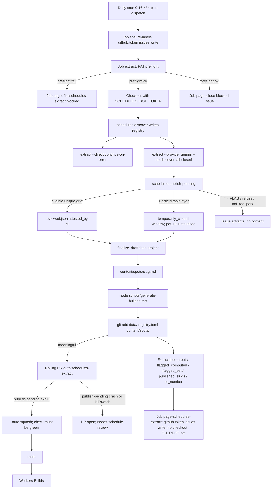

# End-to-end Auto-Publish of Pool Schedules

**Author:** TBD
**Date:** 2026-08-20
**Status:** Draft
**Audience:** Operators of the schedule extract/review pipeline

---

## Overview

Discover already rolls Rec & Park `pdf_url` pins. Extract already writes `data/<slug>/<date>-<sha12>/`. Carry-forward already auto-merges byte-identical payloads. The remaining hole is a new seasonal grid: that payload sits in `data/` until a human runs `just schedules-review`. The live board stays on the last window and reads CLOSED / "Schedule ended."

This design cuts over the publication path. After a successful extract, CI runs a named command `schedules publish-pending`. Eligible unique table `session_grid` payloads get a `reviewed.json` with `attested_by: "ci"`, `project()` writes `content/spots/<slug>.md`, the bulletin bumps, and the rolling PR auto-merges on green `check`. Deploy is unchanged: merge to `main` still ships via Workers Builds.

This **reverses** Key Decision 4 / Open Question 1 (A) from [`docs/specs/2026-08-19-rec-park-pdf-discovery.md`](docs/specs/2026-08-19-rec-park-pdf-discovery.md) and that spec's non-goal "Publishing any session grid without `just schedules-review`." Fully cut over. No dual path. `just schedules-review` remains for FLAG URL adopt and for a **re-queued** bad auto-publish (the UI will not open a dir that still has `reviewed.json`; see Repair sitting). It is not a required gate for eligible pools.

Extract still does not write `content/spots/` itself.

Honest remainder: URL *choice* is not automatable. Sava Fall 1 vs Fall 2, Garfield unlinked 29799, North Beach Cool/Warm, and MLK pt.1/pt.2 stay FLAG. Dual-window ingest and split-PDF extract are later PRs. Unique-grid Rec & Park pools (Hamilton, Coffman, Rossi, Mission, Balboa on 2026-08-19) must not wait on them.

---

## Background & Motivation

### What is still broken after discovery shipped

PRs that landed `discover.py` can rewrite `registry.toml`. They cannot put a fall grid on the board.

| Fact (verified 2026-08-20) | Where |
|---|---|
| Registry pins still point at summer IDs (Hamilton `29599`, MLK `29578`, North Beach `29778`; others `29562`–`29571`) | `schedule-tools/src/schedules/registry.toml` |
| `extract` never writes `content/spots/` | `models.Extracted` docstring; workflow header; `project()` is only reached from `finalize_draft` |
| `extract` writes `reviewed.json` only via `carry_forward_review` | `pipeline.py` `_process_entry` / `_process_direct_entry` |
| Auto-merge requires empty `pending-reviews` **and** empty `discover-blocking` | `.github/workflows/schedules-extract.yml` lines 246–268 |
| Workflow stages `data/` + `registry.toml` only. It does not stage `content/spots/` | Detect step `git add` |
| Grounding floor 0.9 is advisory (`grounding_coverage_low`) | `pipeline.py` `_GROUNDING_MIN_RATIO = 0.9` |
| `validate()` catastrophic is only `sessions_dropped_to_zero`, exempt when `schedule_basis == "temporarily_closed"` | `validate.py` lines 36–44 |
| Seasonal session-count delta is advisory | `delta.py` `delta_session_count_shift` |
| Bulletin hashes `data/**/reviewed.json` paths and bytes | `scripts/generate-bulletin.mjs` |
| `project()` copies `envelope["reviewed_at"]` into `last_verified_at` | `project.py` line 40 |

A healthy cron that auto-adopts Hamilton 29800 still extracts a new SHA, leaves `reviewed.json` absent, labels the PR `needs-schedule-review`, and refuses `--auto` because `pending-reviews` is non-empty. Garfield's flyer FLAG (`discover-blocking`) hostages the same rolling branch, so Hamilton stays off the board even if someone later attested Hamilton alone.

Carry-forward cannot close this hole. Seasonal PDFs always differ. That is a publication-path gap, not a model gap.

### Why "entire process" does not mean "Gemini may pick any PDF"

A bad live temperature is stale for an hour. A bad lap grid sends someone to a closed pool. Auto-publish is allowed only where classification is unique and rollback is a single revert plus a sha quarantine. Auto-picking Cool as North Beach, or unlinked Garfield 29799 as the facility schedule, is publishing the wrong document. That is not this slice.

### What this reverses

From `docs/specs/2026-08-19-rec-park-pdf-discovery.md`:

| Prior rule | After this spec |
|---|---|
| KD 4 / OQ 1 (A): after `effective_end`, keep POST_SEASON until a human reviews. No `content/spots/` write from CI. | CI writes eligible session grids through `publish-pending` → `finalize_draft` → `project()`. |
| Non-goal: "Publishing any session grid without `just schedules-review`." | Unique table `session_grid` auto-publishes. Review is debug / FLAG / repair. |
| Non-goal: bulletin only after human review (`just release`). | Bulletin bumps on auto-projected `reviewed.json`. |
| Auto-merge: `pending-reviews` empty **and** `discover-blocking` empty. | Auto-merge when `publish-pending` exits 0. FLAG is not a merge conjunction. |
| Trust: `reviewed.json` present ⇔ a human opened the PDF (or carry of that). | `reviewed.json` present ⇔ attested. `attested_by` is `human` or `ci`. Git author `github-actions[bot]` is CI provenance. |

---

## Goals & Non-Goals

### Goals

- Auto-publish a unique Rec & Park table `session_grid` from discover → extract → `publish-pending` → auto-merge → deploy with no human on the path.
- Keep extract as an artifact producer. A named publish step is the only new writer of session grids.
- Refuse per pool on catastrophic validate or grounding ratio `< 0.9`. Do not refuse on seasonal session-count delta.
- Drop `discover-blocking` as a merge conjunction so FLAG pools do not hostage unique-grid pools.
- Auto-project Garfield's table flyer as a `temporarily_closed` window without putting it on `pdf_url` and without `--url` / `--adopt` in the workflow.
- Bump `data/bulletin.json` when auto-publish writes `reviewed.json`.
- Rollback: squash-revert of `data/` + content requires `pdf_sha256` quarantine in the same sitting. Per-pool content revert leaves `reviewed.json` in place so the next cron does not republish. See Repair sitting.
- Leave `just schedules-review` working for FLAG URL adopt and for a re-queued bad auto-publish after `reviewed.json` is deleted (or `data/` reverted) so the UI can see the pool.

### Non-goals

- Auto-adopting band-only files Rec & Park has not linked (Garfield 29799).
- Auto-picking one of two whole-pool windows (Sava 29815 vs 29805) as the only `pdf_url`. Dual-window ingest is a later PR.
- Split-PDF extract (North Beach Cool/Warm, MLK pt.1/pt.2).
- Putting a flyer on `pdf_url`.
- Auto-publish of membership/HTML/direct sources in this slice. Carry-forward of identical HTML payloads stays.
- Semantic PDF identity. Byte SHA stays identity. Carry stays payload identity.
- Dual URL history in TOML. Dual envelope files (`auto-projected.json` beside `reviewed.json`).
- Dual-provider CI / daily Anthropic.
- A pending-review chip on the board, a second rolling branch, Slack, Playwright, CivicPlus listing/API.
- New deploy machinery. Merge to `main` still ships.
- Changing `pick_active_schedule` / POST_SEASON copy except insofar as a real projected window exists.

---

## Key Decisions

These resolve the six counsel disagreements. Each is a cut-over, not a shim.

### 1. Envelope: `reviewed.json` with `attested_by: "ci"`

**Decision.** One attestation file. `reviewed.json` present ⇔ this capture is attested for publication. Add optional `attested_by` enum `human` | `ci` to `schedule-tools/src/schedules/schemas/reviewed-snapshot.json`. Omit on legacy files.

| Writer | `reviewed_at` | `attested_by` | `carried_from` | Writes content? |
|---|---|---|---|---|
| Human Save (`just schedules-review`) | Pacific today | `"human"` | absent | yes, via `finalize_draft` |
| CI `publish-pending` (new payload) | Pacific today | `"ci"` | absent | yes, via `finalize_draft` |
| Carry-forward (identical payload) | **prior** `reviewed_at` | **prior** `attested_by` (or omitted) | repo-relative prior path | **no** |
| Legacy committed files | original date | omitted | as today | n/a |

Reject `auto-projected.json`. A second envelope is a second publication predicate: bulletin must hash both, `find_review_candidates` must ignore a new name, `project()` needs a second caller, eval grows a parallel reader. That is the dual path this spec forbids.

**Eval.** Same-dir F1 of a CI-attested `reviewed.json` against the provider JSON that seeded it is 1.0 by construction. Human-attested dirs (`attested_by == "human"` or omitted `attested_by` on legacy files) stay the F1 quality baseline: same-dir provider JSON vs that envelope.

Lookback when the **latest** review dir for a slug is CI-attested (`attested_by == "ci"`, no `carried_from`): walk older review dirs for that slug, newest first. The first envelope whose `attested_by` is `"human"` or omitted may be used as truth for a **seasonal-delta** table (latest provider JSON vs that human payload). If the walk finds only CI envelopes, omit the pair from every table. Never score CI vs CI. Never put seasonal-delta F1 in the quality aggregate — fall Gemini vs the summer human grid is seasonal change, not model regression, and must not gate "require improvement."

Carried dirs (`carried_from` present) keep current same-dir eval (payload identity, prior attestor). CI eval stays observational (`continue-on-error`). Cut the `docs/schedules.md` rule "require improvement, not regression" in the same PR that wires eval skip.

**`last_verified_at`.** `project()` keeps copying `envelope["reviewed_at"]` into the new `[[extra.schedules]]` window. After cut-over this date is last **attestation**, not last human cell check. Update `docs/spec.md` (`# last human verification` → `# last attestation (human Save or CI publish-pending)`). Do not invent `last_attested_at`. Do not pass `last_verified_at=None` for CI windows: a new window with no date fails freshness checks (`scripts/smoke-production.mjs`, agent `freshness.last_verified_at`) and looks unverified on the board. Provenance is `attested_by` in the envelope plus git author `github-actions[bot]`.

Do not copy a prior human `reviewed_at` onto a **new** payload. That would be a false signature.

### 2. Garfield flyer: publish-pending fetches the table `closure_notice` URL from discover notes

**Decision.** Auto-project a `temporarily_closed` window from the Documents-table flyer. Never write that flyer to `pdf_url`. CI never passes `--url` or `--adopt`. Contract-test that no `schedules extract` / `schedules discover` **invocation** in the workflow has `--url` or `--adopt`. Comments may mention those flags (a raw `"--url" not in workflow` substring would fail the day the header explains the rule).

`tmp/discovery-decisions.json` already serializes candidates with `view_id`, `href`, `kind`, `filename`, `anchor_text`, `source`. Garfield 2026-08-19 is `flag` + table `closure_notice` 29808 + band `session_grid` 29799. `publish-pending` may GET `href` for a table `closure_notice` through existing `fetch_pdf(slug, href)` and write artifacts under `data/<slug>/<date>-<flyer-sha12>/`. That is not `extract --url` and it does not rewrite `registry.toml`.

Prefer deterministic date parse from `filename` / `anchor_text` over Gemini. Garfield's table title `Garfield Pool Maintenance Closure 8-14_9-7 2026` → `2026-08-14`..`2026-09-07`. Build `schedule_basis = "temporarily_closed"`, `sessions = []`, one closure, reason from the title. If Gemini were used and emitted lap rows, refuse. This slice does not call Gemini on the flyer.

29799 stays FLAG. Rec & Park did not link it. `--adopt garfield-pool=29799` remains the human confirmation.

If dates do not parse, refuse the closure path, leave the FLAG, comment the rolling flagged issue. Worst case of a successful closure window: the board says closed while Rec & Park reopened a day early. That is better than "Schedule ended Aug 13" during a posted shutdown.

### 3. Merge gate: FLAG does not hostage; refused extracts do not block the PR

**Decision.** Drop both current auto-merge conjunctions. Auto-merge when `publish-pending` exits 0. Per-pool skips are exit 0. A command crash is exit 1: open the PR, do not `--auto`. Green `check` (`ci.yml`) still gates `--auto --squash`.

| Gate | After this change |
|---|---|
| `pending-reviews` empty | **Drop as merge conjunction.** Leftover dirs are FLAG, refused, or out-of-scope (direct/HTML). Holding the whole PR keeps Hamilton off the board because Rossi grounding was 0.89 or Garfield is a flyer. |
| `discover-blocking` empty | **Drop as merge conjunction.** FLAG never writes `pdf_url`. Merging FLAG notes is safe. The CLI stays for the rolling flagged issue and PR copy. |
| `publish-pending` step outcome | **Add.** Auto-merge only when that step succeeded (exit 0). Skipped because kill switch → no `--auto`. |
| green `check` | **Keep.** |

**Do refused extracts block the whole PR?** **No.** A unique-grid pool that fails validate or grounding does not write `reviewed.json` and does not get a content window. Sibling unique-grid pools that passed still publish and the PR still auto-merges. Holding Hamilton because Rossi failed recreates the FLAG-hostage bug with a different predicate.

Operator signal for refusals and FLAG is the rolling GitHub issue `schedules flagged` (Observability), not a merge veto. That pager **lands in the same PR as the CI cut-over** so the first auto-merge does not ship without a durable issue. `needs-schedule-review` is a **label only** on PRs that did **not** auto-merge (kill switch, `publish-pending` crash). Do not put it on an auto-merging PR; the name would be a lie.

Gemini fail-closed (`continue-on-error` absent) still stands. `publish-pending`, bulletin, detect, and PR stay `if: always() && steps.token-preflight.outcome == 'success'` so a red Gemini step does not skip publication of pools that did extract. `--auto` waits on `ci.yml`, not on the extract job being green.

### 4. Sava / North Beach / MLK / band-only 29799 stay FLAG for URL adopt

**Decision.** "Entire process" does not mean auto-pick among documents. Stay FLAG for URL adopt. Dual-window ingest is a later PR, not this slice.

| Pool | Why URL choice is not automatable | This slice |
|---|---|---|
| Sava 29815 (table Fall 1) vs 29805 (band Fall 2) | Publishing Fall 1 alone is the 10-day interim trap: board goes dark on 29 Aug while Fall 2 sits unused. | FLAG both. `source_status` stays `published`. `pdf_url` stays 29571 until `--adopt`. |
| North Beach Cool 29778 / Warm 29779 | One PDF is not the facility. Content already has pool-scoped sessions through 2026-08-29. | FLAG. `missing_current_schedule`. Extract skipped. |
| MLK `pt.1` 29802 / `pt.2` 29803 | Sequential date windows like Sava, not Cool/Warm. Discover no longer uses `pt.1` as a split token; pool+season → `session_grid`. Two IDs FLAG `multiple_windows` and **leave `published`**. | FLAG. Extract still GETs the summer pin until `--adopt`. |
| Garfield 29799 (band-only grid) | Rec & Park did not link it. May be a draft. | FLAG. Closure-only window from 29808 is KD 2, not an adopt of 29799. |

Later (not this slice): dual-window ingest extracts **both** Sava grids and projects **both** `[[extra.schedules]]` only if windows are non-overlapping, both pass gates, and `pdf_url` stays on the table-linked ID. If either fails, publish **neither**. Split-PDF extract (Cool+Warm into one payload with `pool` tags) is separate product work.

After a human `--adopt` of a classified `session_grid`, the next CI pass is `unchanged` on that pointer and `publish-pending` may auto-publish it. That is operator intent, not CI picking.

### 5. Direct/HTML extractors: not this slice

**Decision.** `publish-pending` refuses `source_kind != "sfrecpark_pdf"` with code `not_rec_park`. Direct/HTML stay carry-forward-only. A changed HTML payload remains without `reviewed.json` and does **not** block unique-grid auto-merge (KD 3). Keep `not_rec_park` on the publish scorecard and in `tmp/publish-pending.json` `refused` (a local run must be honest). **Exclude** it from pager `flagged_set`, the `schedules flagged` issue, and the close-condition. That code is out of scope, not a Rec & Park FLAG.

Rationale. The incident is Rec & Park POST_SEASON. Deterministic parsers are safer, but they are not this outage, and opening them this slice increases blast radius (YMCA hours, Koret sheet) for no fall-board benefit. A follow-up PR can drop the `not_rec_park` refuse and reuse the same gates minus grounding (direct `grounding` is `None`).

### 6. Bulletin: bump on auto-publish

**Decision.** Cut over. `BULLETIN` answers "did the schedule payload on the board change?" Auto-publish writes `reviewed.json`; `scripts/generate-bulletin.mjs` already fingerprints those files. Run it **after** `publish-pending`. Number 13 must not stay 12 because no human clicked Save.

No generator code change is required **because** KD 1 kept `reviewed.json` (another reason to reject `auto-projected.json`).

Do **not** bump on discover-only (URL roll, FLAG notes, no content write) unless a new `reviewed.json` also appeared. Do **not** bump on provider JSON that was not published. Carried `reviewed.json` already participates; keep that. `just release` remains the human-path generator. CI uses the same script. `released_schedule_fingerprint` moves when the fingerprint moves.

---

## Proposed Design

### Architecture



### Trust boundary

```mermaid
flowchart LR
  subgraph untrusted ["Untrusted"]
    page["official_page_url HTML"]
    pdf["DocumentCenter PDF"]
    llm["Gemini payload"]
  end
  subgraph gates ["Auto-publish gates"]
    unique["unique table session_grid"]
    val["validate ok; catastrophic exempt only temporarily_closed"]
    ground["grounding ratio >= 0.9"]
    q["sha not quarantined"]
  end
  subgraph attested ["Attested"]
    reviewed["reviewed.json"]
  end
  subgraph trusted ["Trusted / live"]
    spots["content/spots/*.md"]
    board["Public board"]
  end
  page --> discover["discover.py"]
  discover -->|"pdf_url only on unique adopt"| registry["registry.toml"]
  registry --> pdf
  pdf --> llm
  llm --> data["data/ artifacts"]
  data -->|"carry if byte-equal"| reviewed
  data --> gates
  gates -->|"publish-pending attested_by ci"| reviewed
  data -->|"else FLAG / refuse"| review["just schedules-review"]
  review -->|"attested_by human"| reviewed
  reviewed --> project["finalize_draft / project"]
  project --> spots
  spots --> board
```



Extract never crosses into `content/spots/`. Carry writes `reviewed.json` and does not project. `publish-pending` is the CI publisher. Human Save is the override publisher. Both call the same `finalize_draft`.

### Who is the attestor, in one sentence

CI attests: "this payload passed the auto-publish gates against this source hash." A human attests: "I checked the source cells." Carry attests nothing new: "a prior attestor already signed this exact payload."

### Auto-publish gates

`publish_eligible(...)` returns a structured refusal (`code`, `message`). First matching gate wins. Signature is in API / Interface.

| # | Gate | Refuse when | Applies to |
|---|---|---|---|
| 1 | Kill switch | `kill_switch=True` (workflow skips the step; library no-ops if env `SCHEDULES_AUTO_PROJECT=false`) | all |
| 2 | No candidate / identity | no provider JSON; or provider `pdf_sha256` ≠ `candidate.pdf_sha256`; or `candidate.pdf_sha256[:12]` ≠ review-dir name suffix after `YYYY-MM-DD-` | unique-grid path |
| 3 | Not Rec & Park PDF | `source_kind != "sfrecpark_pdf"` | direct/HTML (`not_rec_park`; not a flagged-issue input) |
| 4 | Split / unpublished | `source_status == "missing_current_schedule"` | North Beach, MLK |
| 5 | Discover FLAG | slug is in `blocking_slugs` **except** the closure-only path in KD 2 | Sava, Garfield 29799, splits |
| 6 | Quarantine | `pdf_sha256` is in `quarantined_shas` | all |
| 7 | No merge baseline | `content/spots/<slug>.md` missing, or zero `[[extra.schedules]]` tables | first-ever slug |
| 8 | Catastrophic validate | `validate(payload, prior_sessions_count=...).catastrophic` | unique-grid path |
| 9 | Validate not ok | `not result.ok` | schema, `too_few_weekly_sessions`, bad ranges |
| 10 | Low grounding | PDF extract and `grounding.ratio < 0.9`, or missing `grounding` key (`grounding_unavailable`) | Gemini PDF |
| 11 | Multi-grid PDF | `source.pdf` on disk has ≥2 day-grid pages (`extract_page_texts` / `analyze_page_texts`). Missing `source.pdf` → `source_pdf_missing`. Do **not** parse `tmp/extraction-report-gemini.md`. `save_artifact_bundle` does not persist review notes. | cousin of split |
| 12 | Wrong basis | `schedule_basis` not in `{swim_schedule, temporarily_closed}` | unique-grid path |
| 13 | Effective start regression | new `effective_start` < `max(effective_start)` over **all** `[[extra.schedules]]` tables, not the active snapshot from `pick_active_schedule` | unique-grid path |
| 14 | Closure sessions / uniqueness | closure-only path: `sessions` non-empty (`flyer_emitted_sessions`); dates unparseable (`closure_dates_unparsed` / `closure_dates_invalid`); zero table flyers (`closure_notice_missing`); two or more table flyers (`closure_notice_not_unique`) | Garfield flyer |

`prior_sessions_count` for `validate()` stays the **active** snapshot from `read_schedule_snapshot` (what the board shows now). Gate 13 uses `max(effective_start)` over every window in the file. After POST_SEASON those two values are often the same ended summer grid; they are not the same in general (an upcoming window already merged would make max later than active).

This spec also adds `prior_sessions_count` to `finalize_draft` so a debug-UI Save of drop-to-zero fails unless `temporarily_closed`. One validate contract at the projector.

Grounding floor: same constant as today. Rename `pipeline._GROUNDING_MIN_RATIO` → `GROUNDING_MIN_RATIO = 0.9` in `pipeline.py`; `publish.py` imports it. `total == 0` → ratio 1.0 (already). That is correct for `temporarily_closed`. Missing `grounding` key on a Rec & Park provider JSON → refuse `grounding_unavailable` (fail-closed).

### Do not refuse on

- `delta_session_count_shift` (>20%). A fall grid is supposed to change size. That is the point of auto-publish.
- `delta_session_types_missing`.
- Provider disagreement. CI runs Gemini only.
- Carry-forward captures. They already have `reviewed.json`. They are not `find_review_candidates` hits.
- Prompt or schema hash changes on an **attested SHA** without `--force`. `_process_entry` returns Unchanged when `reviewed_file.exists()` **before** `skip_if_fresh` (`pipeline.py` lines 153–160). Daily CI does not pass `--force`. Gemini is not re-called, provider JSON is not overwritten, eval does not move, `find_review_candidates` never sees the dir. Seasonal URL adopts are **new SHAs** and may publish. Do not delete that reviewed-snapshot fast path to "make eval alarm"; that would create the nine-pool blast this gate thinks it already refused. A prompt-change quality check is a local `--force` bakeoff, not the daily job.

### Unique-grid path

For each `find_review_candidates()` hit (provider JSON present, `reviewed.json` absent):

1. Load registry entry (`source_kind`, `source_status`), `tmp/discovery-decisions.json` blocking slugs, `quarantine.toml`, content file (all `[[extra.schedules]]` plus the active snapshot), provider payload, provider `grounding`, and `source.pdf` from `candidate.source_path` when it exists.
2. Recompute multi-grid from `source.pdf` via `extract_page_texts` / `analyze_page_texts`. CI has the file because `fetch_pdf` just ran (gitignored, present on the runner). Missing file → refuse `source_pdf_missing`.
3. `publish_eligible(...)`. On refuse: record, write nothing, continue.
4. `draft_envelope(...)` then set `attested_by = "ci"`. `reviewed_at` = Pacific today. No `carried_from`.
5. Write `reviewed.json`. Call existing `finalize_draft`. On failure, unlink `reviewed.json` (same as `ReviewApp.save`) so the filesystem predicate stays honest.

Reuse `draft_envelope`, `finalize_draft`, and `project()`. Do not add a second projector. Do not have `extract` write new (non-carry) `reviewed.json`.

### Closure-only path (Garfield)

Runs inside `publish-pending` after the unique-grid loop. Not a workflow `--url`.

Eligible when **all** of:

1. Discover decision for the slug is `action == "flag"` and `blocking` is true.
2. **Table** candidates with `kind == "closure_notice"`: count them from the decision JSON (`source == "table"`). Zero → refuse `closure_notice_missing`, do not fetch. Two or more → refuse `closure_notice_not_unique`, do not fetch. Exactly one continues.
3. No table `session_grid` (the unique-grid path would have adopted).
4. Dates parse from that one candidate (search order below).
5. No existing `[[extra.schedules]]` window with the same `effective_start`.
6. Flyer `pdf_sha256` is not quarantined (checked after `fetch_pdf`).

Reconstruct the flyer from the JSON dict (`view_id`, `href`, `anchor_text`, `filename`, `kind`, `source`). Do not require a live `ClassifiedDocument` instance.

Date parse: `parse_closure_dates(filename, anchor_text)`. Search **`anchor_text` first, then `filename`** (title is what Rec & Park shows). First matching pattern across that order wins:

```
M-D_M-D YYYY     e.g. 8-14_9-7 2026     → 2026-08-14 .. 2026-09-07
Month D to Month D, YYYY
Month D–D, YYYY  (same month)
```

Year from the matched token; if the pattern has no year, Pacific today’s year. End before start in the same year is a refuse (`closure_dates_invalid`), not a year wrap. Unparseable after both strings → `closure_dates_unparsed`, leave FLAG, do not fetch.

Then:

1. `fetch_pdf(slug, href)` — cache-hit if an operator already `--url`'d the flyer.
2. Build payload: `schedule_basis="temporarily_closed"`, `sessions=[]`, `effective_start`/`effective_end` = parsed dates, `closures=[{start, end, reason}]`. `reason` is the stripped title/filename.
3. Write `reviewed.json` with `attested_by: "ci"`, `source_pdf_url` = flyer `href`, `pdf_sha256` of the flyer bytes.
4. `finalize_draft`. `pdf_url` in `registry.toml` is untouched.

Do not write a fake Gemini provider JSON. Closure is a publisher-built envelope, not a review-candidate seed. `find_review_candidates` will not see this dir until `reviewed.json` exists; after write it is attested.

Band-only 29799 is ignored here.

### Carry-forward

Unchanged. Extract still writes `reviewed.json` with `carried_from`. `publish-pending` does not see those dirs. Content already has that payload; `merge()` would be a no-op. Skip the project call so `last_verified_at` is not discussed as a CI bump of an unchanged window.

A carried CI attestation may seed the next carry. Do not walk `carried_from` back to a human as a requirement.

### Kill switch

Repo Actions variable `SCHEDULES_AUTO_PROJECT`. Default **on** (unset or any value other than `false`). When `false`, the workflow **skips** the `publish-pending` step. Skipped step outcome is `skipped`, so `--auto` does not run. Extract still writes artifacts. Same as today: review queue, no `content/spots/` write. Use after a bad publish while quarantine lands.

`workflow_dispatch` input `auto_project` (choice `true`/`false`, default `true`) overrides the variable for one run.

```yaml
on:
  schedule:
    - cron: '0 16 * * *'
  workflow_dispatch:
    inputs:
      auto_project:
        description: "Run publish-pending (set false to extract-only)"
        type: choice
        options: ["true", "false"]
        default: "true"
```

Step `if:`:

```
always() && steps.token-preflight.outcome == 'success' && vars.SCHEDULES_AUTO_PROJECT != 'false' && (github.event_name != 'workflow_dispatch' || inputs.auto_project != 'false')
```

Contract-test the `vars.SCHEDULES_AUTO_PROJECT != 'false'` fragment.

### CI step order

Keep the three jobs, PAT preflight, discover-before-Gemini, no Anthropic, no `--url` / `--adopt` on invocations. Rewrite the workflow header: this workflow **does** edit `content/spots/` via `publish-pending`. Comments may mention `--url`; invocations must not pass it.

Extract job after checkout:

1. Token preflight (unchanged).
2. Checkout (`SCHEDULES_BOT_TOKEN`).
3. Python + uv sync.
4. `schedules discover`.
5. `schedules extract --direct` (`continue-on-error: true`).
6. `schedules extract --provider gemini --no-discover` (fail-closed). **Still no content writes.**
7. **`schedules publish-pending`** (`id: publish-pending`, `if:` as above). Writes `tmp/publish-pending-report.md` and `tmp/publish-pending.json`.
8. Eval (`continue-on-error`, after publish-pending so `attested_by: ci` is visible and skipped from the quality aggregate).
9. `node scripts/generate-bulletin.mjs` (`if: always() && token-preflight success`).
10. Publish extraction evidence + upload artifacts (`if: always()`). Glob includes `tmp/publish-pending-report.md` (the file exists now). `if-no-files-found: warn` when kill switch skipped publish-pending.
11. Detect: `git add data/ schedule-tools/src/schedules/registry.toml content/spots/` plus `schedule-tools/src/schedules/quarantine.toml` if that file changes.
12. Commit / force-push `auto/schedules-extract` / `gh pr create|edit` / `--auto --squash` when `steps.publish-pending.outcome == 'success'`. This step’s `if:` stays `always() && preflight && detect.changed == true`. It may set `pr_number` as a **step** output. It does **not** own `flagged_set`.
13. **Set pager outputs** (`id: pager-outputs`, `if: always() && steps.token-preflight.outcome == 'success'`). **Not** gated on `detect.outputs.changed`. Quiet cache-hit days and kill-switch runs still execute it.

Pager-outputs computes:

| Output | Source |
|---|---|
| `flagged_computed` | `true` iff `tmp/discovery-decisions.json` exists (a discover pass wrote it). Else unset/`false`. Unknown ≠ empty. |
| `flagged_set` | Sorted `(slug, code/reason)` from that decisions file (blocking) **plus**, when `tmp/publish-pending.json` exists, unique-grid/closure refuses. Filter out `not_rec_park`. If publish-pending was skipped, this is discover-blocking only. |
| `published_slugs` | From `tmp/publish-pending.json` when present; else empty. |
| `pr_number` | From the PR step output when that step ran; else empty. |

Do not close `schedules flagged` from unset outputs. Contract-test: this step’s `if:` contains `token-preflight` and does **not** contain `detect.outputs.changed`.

Do not upload artifacts before `publish-pending`. A second upload step after it is also acceptable; one upload after it is enough.

Do not add `source.pdf` / `source.html` / `source.xlsx` / `source.csv` (already gitignored). Localized `content/spots/<slug>.<lang>.md` siblings should not change (`project()` writes the English canonical file only).

Meaningful-change detect: a `content/spots/` diff is always meaningful. Registry `pdf_url` / notes change stays meaningful even if `data/` is quiet.

```bash
git add data/ schedule-tools/src/schedules/registry.toml content/spots/ schedule-tools/src/schedules/quarantine.toml
if git diff --staged --quiet; then
  echo "changed=false"
elif git diff --staged --name-only | grep -qE 'registry.toml|content/spots/|quarantine.toml'; then
  echo "changed=true"
elif ! uv --project schedule-tools run schedules has-meaningful-staged-data-changes; then
  echo "changed=false"
else
  echo "changed=true"
fi
```

Auto-merge block (replace pending ∩ blocking):

```bash
if [ "${{ steps.publish-pending.outcome }}" = "success" ]; then
  gh pr merge "${PR_NUMBER}" --auto --squash \
    || echo "::notice::auto-merge unavailable; PR #${PR_NUMBER} left open for manual merge"
else
  gh pr edit "${PR_NUMBER}" --add-label "needs-schedule-review"
  echo "publish-pending did not succeed; not auto-merging."
fi
```

Do not call `schedules pending-reviews` or `schedules discover-blocking` in this block. They remain CLI tools.

### Expected 2026-08-19 first auto-publish run

Registry max before rewrite is 29778. Shared band sees 29799 and 29805. After discover:

| Pool | Discover | Extract | publish-pending | Board after merge |
|---|---|---|---|---|
| Balboa 29797 | adopt | new SHA | auto-publish fall/interim grid | live window |
| Coffman 29798 | adopt | new SHA | auto-publish | live window |
| Hamilton 29800 | adopt | new SHA | auto-publish | live window |
| Mission 29801 | adopt | new SHA | auto-publish | live window |
| Rossi 29804 | adopt | new SHA | auto-publish | live window |
| Garfield 29808 + 29799 | FLAG | summer 29564 Unchanged | closure-only window from 29808; 29799 stays FLAG | closed 14 Aug–7 Sep, then POST_SEASON until `--adopt` 29799 or a table grid |
| Sava 29815 + 29805 | FLAG both | summer 29571 Unchanged | refuse (`discovery_flagged`) | last reviewed window; POST_SEASON after 15 Aug until dual-window or `--adopt` |
| MLK 29802/29803 | FLAG `multiple_windows` (pt.1 is `session_grid`, not `split_part`) | summer pin Unchanged | refuse (`discovery_flagged`) | last reviewed window |
| North Beach 29778/29779 | FLAG split | skipped | refuse (`split_pdf`) | interim content through 29 Aug, then POST_SEASON |

Five unique grids plus one closure is the honest "entire process" for this season. Two split facilities and one two-window pool stay operator work.

---

## API / Interface Changes

### New CLI

```
schedules publish-pending
```

Processes every `find_review_candidates()` entry plus the closure-only path. Prints `tmp/publish-pending-report.md` and `N published, M refused`. Exit 0 after processing, including when some pools are refused. Crash / I/O error exits 1.

No `--publish` flag on `extract`. Local extract on a laptop stays an artifact producer. An operator who wants a local publish runs `just schedules publish-pending` after extract. `just schedules *args` already forwards; no new just recipe required.

`just schedules-review` stays. Human Save writes `attested_by: "human"`. The UI and `find_review_candidates` skip any dir that already has `reviewed.json`. After CI attests, `just schedules-review` prints `nothing to review` until the operator re-queues that dir. See Repair sitting. A quarantined SHA lands only after that re-queue plus Save.

### Library (`schedule-tools/src/schedules/publish.py`)

```python
# GROUNDING_MIN_RATIO = 0.9 lives in pipeline.py; publish imports it.

@dataclass(frozen=True)
class Eligibility:
    ok: bool
    code: str | None    # sessions_dropped_to_zero, grounding_coverage_low,
                        # grounding_unavailable, discovery_flagged, split_pdf,
                        # multi_grid_suspected, source_pdf_missing, validate_failed,
                        # not_rec_park, quarantined, no_merge_baseline,
                        # effective_start_regressed, identity_mismatch,
                        # closure_dates_unparsed, closure_dates_invalid,
                        # closure_notice_missing, closure_notice_not_unique,
                        # flyer_emitted_sessions
    message: str = ""

def publish_eligible(
    *,
    candidate: ReviewCandidate,
    payload: dict,
    grounding: GroundingResult | None,
    prior_sessions_count: int,          # from read_schedule_snapshot (active window)
    latest_effective_start: str | None, # max(effective_start) over all [[extra.schedules]]
    source_kind: str,
    source_status: SourceStatus,
    blocking_slugs: frozenset[str],
    quarantined_shas: frozenset[str],
    has_prior_schedule_window: bool,    # len([[extra.schedules]]) > 0
    source_pdf_path: Path | None,
    kill_switch: bool = False,
) -> Eligibility: ...

def publish_candidate(
    *,
    candidate: ReviewCandidate,
    content_spots_dir: Path,
    attested_at: date,
    eligibility: Eligibility,
) -> Path:
    """Write reviewed.json (attested_by=ci) and finalize_draft. Unlink on failure."""

def publish_closure_notice(
    *,
    slug: str,
    flyer: dict,  # discovery-decisions.json candidate: view_id, href,
                  # anchor_text, filename, kind, source. Not a live ClassifiedDocument.
    content_spots_dir: Path,
    attested_at: date,
    quarantined_shas: frozenset[str],
) -> Path | None:
    """Fetch flyer URL, parse dates, project temporarily_closed. No registry write."""

def publish_pending_all(
    *,
    data_root: Path = DATA_DIR,
    content_spots_dir: Path = CONTENT_SPOTS_DIR,
    today: date | None = None,
) -> tuple[int, Path]:
    """Returns (published_count, report_path). Writes tmp/publish-pending-report.md
    and tmp/publish-pending.json."""
```

Also export `parse_closure_dates(filename: str | None, anchor_text: str | None) -> tuple[date, date] | None` (search `anchor_text` then `filename`). Helper `latest_effective_start(md_path: Path) -> str | None` reads every `[[extra.schedules]]` table; do not call `read_schedule_snapshot` for gate 13.

### Envelope schema

In PR 1, change the schema `"title"` / `"description"` from "Human-reviewed snapshot" to **Attested snapshot**: locks a canonical payload to a source hash. Attestor is human Save, CI `publish-pending`, or carry. Keep legacy omit valid.

Add optional `attested_by` (`additionalProperties` is false, so the key must be declared):

```json
"attested_by": {
  "type": "string",
  "enum": ["human", "ci"],
  "description": "Who signed this snapshot. Omit on legacy files. Carry copies the prior value and sets carried_from."
}
```

Update `reviewed_at` and `carried_from` descriptions in the same PR: `reviewed_at` is the Pacific date of the attestor action, not necessarily a human cell check. `carried_from` points at a prior attested snapshot (human, CI, or omitted).

`draft_envelope` gains optional `attested_by` (default `"human"` for the debug UI). `ReviewApp.save` sets `"human"` before `finalize_draft`. Update `carry_forward_review`'s docstring in PR 1: it copies a prior attestation, not specifically a human one.

`finalize_draft` gains `prior_sessions_count` from `read_schedule_snapshot` of that slug.

### Quarantine

New committed file `schedule-tools/src/schedules/quarantine.toml` (TOML: human-authored config). Empty list is valid.

```toml
# pdf_sha256 values publish-pending must refuse.
# Human review may still attest. Delete the row to resume auto-publish.

# [[quarantine]]
# pdf_sha256 = "…"
# slug = "hamilton-pool"
# reason = "wrong Saturday family swim"
# added = "2026-08-20"
```

`load_quarantine() -> frozenset[str]` returns SHAs. Match on sha, not slug: the next season PDF is a new SHA. Slug is documentation.

Do not quarantine by slug forever.

### Eval

`collect_pool_evals` lookback:

1. Same-dir truth only when `attested_by` is `"human"` or omitted (legacy). That pair stays in the quality aggregate.
2. If the latest dir is `attested_by == "ci"` with no `carried_from`, do not use it as same-dir truth. Walk older dirs for that slug, newest first. First `"human"` or omitted envelope is truth; diff the **latest dir's provider JSON** against that payload. That row belongs in a separate **seasonal-delta** table only. It is not the quality baseline and must not gate "require improvement."
3. If the walk finds only CI envelopes, omit the pair from every table. Never score CI vs CI.
4. Carried dirs keep same-dir eval (quality aggregate: payload identity).

### PR copy (`pr_summary.py`)

Lead on happy path (at least one CI-attested or carried `reviewed.json`, no publish crash):

```
Published N Rec & Park pools. This PR auto-merges once checks pass.
The live site updates when this PR merges.
```

Per slug: old ID → new ID, filename, kind, `effective_start`–`effective_end`, session count, `auto` vs `carried`. FLAG / refuse lists are informational, not a review checklist. Direct/HTML `not_rec_park` may appear on that refuse list; it does not belong on the rolling flagged issue.

Delete:

- "needs a human review"
- "live site stays on last reviewed window until review"
- the 5-step `just schedules-review` checklist on auto-merge PRs

`_render_whats_here`: CI-attested `reviewed.json` is "auto-published (`attested_by: ci`)", not "attestation carried forward." Carry keeps the carried line.

Checklist **only** when `publish-pending` did not succeed (kill switch or crash). Then it may mention `just schedules-review` as debug.

### Workflow contract (`tests/test_schedule_workflow_contract.py`)

Replace `test_auto_merge_requires_discover_blocking` and extend `test_git_add_includes_registry`:

- Extract steps still contain "no content writes" and do not call `publish-pending`.
- New step `schedules publish-pending` after Gemini, before eval/bulletin.
- Bulletin still after publish-pending.
- Detect `git add` includes `content/spots/`.
- Auto-merge keys on `steps.publish-pending.outcome == 'success'`.
- Auto-merge does **not** call `pending-reviews` or `discover-blocking`.
- Workflow does **not** run `schedules review`.
- No `schedules extract` / `schedules discover` `run:` line contains `--url` or `--adopt`. Comments **may** contain those tokens. Do not assert `"--url" not in workflow` (that substring fails the day the header explains the rule). Keep no-Anthropic and discover-before-Gemini.
- Header/comments do not say the workflow never edits `content/spots/`.
- Kill-switch `if:` contains `vars.SCHEDULES_AUTO_PROJECT != 'false'`.
- `ensure-labels` also force-creates `schedules-published` and `schedules-flagged`.
- Pager job still has `GH_REPO: ${{ github.repository }}` and no `actions/checkout`. Extract job still has no `github.token`.
- Upload step appears **after** the `publish-pending` step. Upload glob includes `tmp/publish-pending-report.md`.
- A `Set pager outputs` / `pager-outputs` step has `if: always() && steps.token-preflight.outcome == 'success'` and does **not** mention `detect.outputs.changed`. The Open-or-update-PR step may set `pr_number` but must not be the only writer of `flagged_set`.

### `pending-reviews` / `discover-blocking`

Keep both commands. Docstrings: they are operator/issue signals, not auto-merge gates. `pending-reviews` prints slugs with no `reviewed.json`. After cut-over that set is FLAG, refused, and out-of-scope direct/HTML.

---

## Data Model Changes

### `reviewed.json`

Optional `attested_by`. Predicate unchanged. CI is a valid attestor.

### `content/spots/<slug>.md`

No schema change. `merge()` still appends/replaces by `effective_start`. New windows get `last_verified_at` = attestation date. Localized siblings unchanged.

### `registry.toml`

No new fields. FLAG notes and `pdf_url` rules from the discovery spec stand. Discover still never writes a flyer to `pdf_url`.

### `quarantine.toml`

New. See API. Staged on the rolling PR when an operator (or a follow-up revert sitting) adds a row.

### Artifacts

| Path | Committed? | Role |
|---|---|---|
| `tmp/publish-pending-report.md` | no | Human-readable publish scorecard; step summary |
| `tmp/publish-pending.json` | no | Machine: published slugs, `refused` `{slug, code}` (**every** code, including `not_rec_park`), closure slugs. Scorecard and PR copy read this. Pager `flagged_set` is a **filtered** subset. |
| `data/<slug>/<date>-<sha12>/reviewed.json` | yes | Attestation (human, ci, or carry) |
| `content/spots/<slug>.md` | yes | English canonical grid `project()` writes |
| `data/bulletin.json` | yes | Fingerprint + number bump |
| `schedule-tools/src/schedules/quarantine.toml` | yes | SHA refuse list |

### Validation

No new `validate.py` codes. Eligibility is a publisher concern. `finalize_draft` starts passing `prior_sessions_count` so the projector matches extract.

---

## Alternatives Considered

### A. `auto-projected.json` plus human-only `reviewed.json`

Ops lane.

- **For:** Eval cannot treat Gemini as truth. `last_verified_at` stays "a human checked this PDF." Byte-identical review-UI guard stays a human-path concern.
- **Against:** Two envelopes, two bulletin inputs, two `project()` callers, `find_review_candidates` must learn a new name. Dual publication predicate. Eval poisoning is solved by a human/omitted quality baseline and omitting CI-vs-CI (KD 1). Rejected.

### B. Fake a human `reviewed_at` with no `attested_by`

- **Against:** Lies in the attestation. Rejected.

### C. Drop `reviewed.json` and project from provider JSON

- **Against:** Two authorities. The filesystem predicate stays. Rejected.

### D. `extract --publish` inside `_process_entry`

- **Against:** Makes extract a publisher and a fetcher. Breaks the "extract never writes content" test seam. Local extract on a laptop would write `content/spots/`. Rejected.

### E. Keep `just schedules-review` as a required gate "for now"

- **Against:** Dual path. The board stays dark until someone sits. Rejected.

### F. Auto-merge only when every auto-eligible pool published (refused extracts block the PR)

Ops lane.

- **For:** Avoids mixing unpublished Gemini JSON with no operator signal.
- **Against:** Rossi grounding 0.89 hostages Hamilton. Same shape as today's FLAG hostage. Observability is the rolling flagged issue, not a merge conjunction. Unpublished JSON on `main` is evidence, not a live grid. Rejected as a merge veto. Accepted as an issue comment.

### G. Auto-merge when `pending-reviews` empty, with FLAG still blocking

Pipeline lane's first merge rule.

- **Against:** User required dropping `discover-blocking` as a merge conjunction. FLAG notes must not hold unique grids. Rejected.

### H. CI `--url` of Garfield 29808

- **Against:** Workflow **invocations** must not pass `--url`. Would look like extract of a flyer as the pool source. Fetch lives inside `publish-pending` from discover notes. Rejected.

### I. Auto-adopt Garfield 29799 or Sava Fall 1

- **Against:** Wrong document / 10-day trap. User asked for honesty, not a silent pick. Rejected.

### J. Include direct/HTML this slice

Pipeline lane / CI "if validate passes."

- **For:** Parsers are safer than Gemini. "Entire process."
- **Against:** Not this incident. Blast radius on YMCA/Koret for no fall-board gain. Carry already publishes identical HTML. Follow-up can drop `not_rec_park`. Deferred, not dual-pathed for Rec & Park.

### K. Leave bulletin for `just release` after human review

Discovery spec non-goal.

- **Against:** Masthead would lie after auto-publish. User required bump. Rejected.

### L. Soak the first cohort behind `SCHEDULES_AUTO_PROJECT=false`

Ops discussion question.

- **Against:** That is the current outage. Kill switch exists for after a bad publish. First unique-grid run auto-merges. Rejected as a default.

---

## Security & Privacy Considerations

- Facility pages and DocumentCenter PDFs are public. No new credentials.
- `publish-pending` fetches the same public View URLs discover already classified. Bot UA on discover stays. `fetch_pdf` still sends no UA (out of scope; DocumentCenter View already 200s).
- `SCHEDULES_BOT_TOKEN` stays Contents + Pull requests. It does **not** gain Issues. Rolling published/flagged comments use `github.token` in the pager job (`issues: write`, no checkout), same isolation as `schedules-extract blocked`.
- Still no `pull_request_target`. Fork dispatch pages the fork.
- Auto-publish can now put Gemini rows on the live board. Mitigation is the gate table, per-pool refuse, kill switch, and sha quarantine. A misclassified unique grid is a content incident, not an infra incident. Do not revert `discover.py` for wrong hours.
- `--url` / `--adopt` remain operator overrides. CI does not pass them.
- Quarantine file is not secret. Do not put credentials in `reason`.

---

## Observability

Do not rely on the Actions tab. Three durable surfaces plus the existing blocked issue. The pager **ships in the CI cut-over PR** (PR 2), not a follow-up: auto-merge must not land without this signal.

| Signal | When | Surface |
|---|---|---|
| `schedules-published` | Auto-merge of a PR that published at least one pool (`attested_by: ci` or a new content window) | Rolling issue title exact `schedules published`, label `schedules-published`, author `github-actions[bot]`. Comment each ship: run URL, PR number, bulletin label, per slug old `effective_end` → new window, session count, auto vs carried. Close nothing. |
| `schedules-flagged` | Discover **blocking** slugs **or** unique-grid/closure refuses (see set below) | Rolling issue title exact `schedules flagged`, label `schedules-flagged`. Per-slug class/IDs/refuse code. This replaces FLAG as an auto-merge veto. |
| `schedules-extract blocked` | Token preflight fail | Unchanged. Close on preflight success. Do not use this issue for Gemini red or publish refuse. |

**Flagged set.** Sorted unique `(slug, code/reason)` rows from:

- `discover-blocking` slugs (FLAG: split, flyer, band-only, 2+ windows, empty table, fetch error)
- `publish-pending` refuses that are **auto-eligible Rec & Park**: unique-grid path that passed gates 3–5 (so `source_kind == sfrecpark_pdf`, not `missing_current_schedule`, not discover-blocking) and then failed a later gate, **or** the closure-only path (`closure_dates_unparsed`, `closure_notice_missing`, `closure_notice_not_unique`, `flyer_emitted_sessions`, `quarantined` on the flyer)

**Exclude** `not_rec_park` from `flagged_set` only. The publish scorecard and `tmp/publish-pending.json` `refused` still list it. A YMCA hours churn must not page the Rec & Park FLAG surface.

**Debounce (one rule).** Parse the last `github-actions[bot]` comment on the rolling `schedules flagged` issue.

- If `flagged_computed` is not `true`, do **not** comment and do **not** close (unknown ≠ empty).
- Comment when today’s sorted `flagged_set` **differs** from that last comment’s set.
- **Or** comment when this run opened/updated a PR (`pr_number` non-empty) **and** `flagged_set` is non-empty, even if the set is unchanged. That links the shipping PR on the FLAG issue without waiting for a FLAG change.
- Do **not** comment on a quiet run (no PR) whose set equals the last comment. Cache-hit days stay silent.

`schedules published` still comments each ship. The PR-open clause on `schedules flagged` is extra linkage, not a daily FLAG digest.

**Close.** Close `schedules flagged` only when **all** of:

1. `flagged_computed == 'true'` (a discover pass ran and wrote `tmp/discovery-decisions.json`; the pager-outputs step ran).
2. Computed `flagged_set` is empty (no blocking slugs **and** no unique-grid/closure refuses).

Never close on a quiet/no-PR day just because outputs were unset. Never treat a missing `flagged_set` as empty. Kill switch: publish-pending skipped, discover still ran → `flagged_computed=true` and `flagged_set` is discover-blocking only (still non-empty in fall 2026). During fall 2026 the FLAG set stays (Garfield, Sava, MLK, North Beach), so the issue stays open; we just stop daily-commenting.

Pager job (`page-schedules-extract`, extend in place; no fourth job):

- `permissions: { issues: write }`, no checkout, `GH_TOKEN: ${{ github.token }}`, `GH_REPO: ${{ github.repository }}` (existing tests require `GH_REPO` on pager jobs).
- Reads extract job outputs only (`preflight_outcome`, `publish_pending_outcome`, `flagged_computed`, `published_slugs`, `flagged_set`, `bulletin_label`, `pr_number`). Compact. Details live in the PR body and `tmp/publish-pending-report.md` on the Actions summary.
- `ensure-labels` force-creates `schedules-published` and `schedules-flagged` in addition to the two existing labels.

Also visible with no GitHub:

- Live masthead bulletin increments (swimmer-facing).
- Squash commit on `main` and the merged PR body.
- Workers Builds deployment list.

Gemini fail-closed: red Actions run + GitHub email. Do not file `schedules-extract blocked`.

Do **not** add Slack, a second rolling branch, or a pending-review chip on the board. FLAG pools may still show POST_SEASON; the operator issue is the signal, not a fake grid.

---

## Rollout Plan

No feature flag other than the kill switch (default on). Cut over.

### Rollback if Gemini publishes a wrong grid

Merge appends a new `[[extra.schedules]]` by `effective_start`. It must not rewrite or delete earlier windows. The previous grid stays in the file.

**Fast (minutes).** Cloudflare Workers Builds → prior successful deploy → Rollback. Use when the live board is wrong **right now**. It does not fix git. The 00:00 PT daily rebuild and the next push to `main` will republish the bad commit. Dashboard rollback is a tourniquet.

**Do not roll back infrastructure** for a bad grid. Do not revert `discover.py`. Do not clear `pdf_url` back to summer unless the adopt itself was wrong (wrong file, not wrong rows). A wrong Gemini payload is a content incident.

**Hold the blast.** One catastrophic Hamilton extract must not block Rossi. One published-wrong Hamilton must not revert Coffman. The rolling PR stays one branch; revert commits on `main` may be narrower than the original squash.

**Kill switch.** Set `SCHEDULES_AUTO_PROJECT=false` after a bad publish while the sitting below lands on `main`.

### Two revert shapes (quarantine is not always required)

**Squash revert of the rolling commit** (removes `content/spots/` **and** `data/` attestations): the next 09:00 PT run will discover the same ID, extract the same SHA, pass the same gates, and republish unless that sha is quarantined. Add a `[[quarantine]]` row for that `pdf_sha256` **in the same sitting**. Without it, revert is useless.

**Per-pool content revert** (delete only that `[[extra.schedules]]` table; leave other pools and leave `data/<slug>/…/reviewed.json`): the reviewed-snapshot fast path returns Unchanged (`pipeline.py` lines 153–160); `publish-pending` sees no candidate; the next cron will **not** re-project. Quarantine is **not** required. Do not delete `reviewed.json` as "cleanup" unless you also quarantine — deleting the attestation without a quarantine row is how the next cron ships the same grid.

### Repair sitting (ordered)

The review UI will not open an already-attested dir. `just schedules-review` after a bad ship, with `reviewed.json` still present, prints `nothing to review`.

1. Kill switch: `SCHEDULES_AUTO_PROJECT=false`.
2. Dashboard tourniquet if the live board is wrong right now.
3. Choose a revert shape (above). Prefer per-pool content revert when five grids shipped and one is wrong.
4. If you squash-reverted `data/`, add `[[quarantine]]` on `main` in the same sitting. If you only deleted the markdown window, leave `reviewed.json`.
5. Confirm candidate state: `schedules pending-reviews` lists the slug **only if** `reviewed.json` is gone.
6. To put a **human-corrected** payload of that SHA on the board: quarantine already on `main` (if the attestation was removed) → delete `reviewed.json` or keep the squash-reverted empty dir → `just schedules-review` Save (`attested_by: human`). `finalize_draft` does not consult `quarantine.toml`; that is the override. `publish-pending` still refuses the sha until the row is deleted.
7. Clear the kill switch after `main` has the revert (and quarantine row, if required).

Do not skip step 5. An operator who only runs `just schedules-review` will see an empty queue.

### First-run load

- Same discover cost as the discovery spec (9 HTML GETs, one 40-wide band, ~8s).
- 5 new Gemini extractions (the five adopts), Unchanged fetches of flagged published summer pins (Garfield, Sava), skip MLK/North Beach.
- One extra PDF GET for Garfield 29808 inside `publish-pending`.
- 5 content writes + 1 closure window + bulletin bump + one rolling PR that auto-merges.

### Copy that lands with the workflow (PR 2)

Operator-facing copy that still says "a human checked this PDF" or "run `just schedules-review`" as the happy path becomes false the day auto-merge ships. PR 2 must cut over: workflow comments, `pr_summary.py` lead, `docs/schedules.md` (Review Flow, Auto-extract, Future v4, eval "require improvement"), `docs/spec.md`, `NAPKIN.md` item 5, Repair sitting, and the pager. Eval is no longer a human-quality signal for auto-published dirs.

`models.Extracted` docstring (PR 1): extract does not publish; `publish-pending` does.

Field notes (`content/field-notes/source-review-lane.md`, `byte-identical-reviews.md`) and the README extract blurb are **PR 3**. They are not the merge-veto replacement. Byte-identical refusal in the review UI is already stale (`test_finalize_accepts_byte_identical_provider_payload`); CI writing `attested_by: ci` on a payload equal to the provider JSON is the intended auto path, not a loophole.

Force-push of the rolling branch still wipes uncommitted local review. After cut-over: `--adopt` locally then `workflow_dispatch`, or push onto the same rolling PR.

---

## Open Questions

None of the six counsel disagreements remain open. Remaining work is later PRs, not product forks of this slice.

1. **Dual-window ingest for Sava.** Extract both 29815 and 29805; project both windows; `pdf_url` stays table-linked. If either fails, publish neither. Not this slice.
2. **Split-PDF extract** for North Beach Cool/Warm. Not this slice. `--adopt` of a `split_part` must still not set `published`. MLK `pt.1`/`pt.2` belong with Sava on dual-window ingest, not this split-token.
3. **Direct/HTML auto-publish.** Drop `not_rec_park` once Rec & Park unique-grid auto-publish has soaked. Same `publish-pending`, skip grounding, keep validate + prior window + quarantine.

---

## Testing

### `tests/test_publish_pending.py` (new)

Eligibility:

- Catastrophic `sessions_dropped_to_zero` with prior > 0 and `schedule_basis != "temporarily_closed"` → refuse, no `reviewed.json`, no content write.
- Same with `schedule_basis == "temporarily_closed"` → eligible.
- `too_few_weekly_sessions` → refuse (`not result.ok`).
- Grounding ratio 0.89 → refuse. 0.90 → eligible. `total == 0` → eligible on grounding (other gates still apply).
- Missing `grounding` key on Rec & Park provider JSON → refuse `grounding_unavailable`.
- `source_kind != "sfrecpark_pdf"` → refuse `not_rec_park`.
- Discover `blocking: true` → refuse even if payload validates and grounding is 1.0 (unique-grid path).
- `source_status == "missing_current_schedule"` → refuse.
- Fixture `source.pdf` with two day-grid pages → refuse `multi_grid_suspected`. Missing `source.pdf` → `source_pdf_missing`. Do not feed review notes from the extract report.
- Identity: provider sha ≠ candidate sha → `identity_mismatch`.
- Quarantined SHA → refuse; human `finalize_draft` of the same SHA still allowed in a separate test.
- Zero `[[extra.schedules]]` → refuse `no_merge_baseline`.
- `effective_start` earlier than `max(effective_start)` over all windows → refuse, even when `read_schedule_snapshot` (active) would be an older ended window.
- Delta 20%+ session shift, no other gates → **eligible**.

Write + project:

- Eligible PDF candidate: writes `reviewed.json` with `attested_by: "ci"`, `reviewed_at` = injected Pacific today, no `carried_from`; `content/spots/<slug>.md` contains the sessions and `last_verified_at` equal to that date.
- `finalize_draft` failure unlinks `reviewed.json`.
- Second run on the same dir: candidate gone; no double-write.

Closure-only:

- Table `closure_notice` with `8-14_9-7 2026` on **anchor_text** (filename empty) → window 2026-08-14..2026-09-07; `pdf_url` fixture unchanged.
- Same pattern only on filename (anchor_text empty) still parses.
- Zero table flyers → `closure_notice_missing`, no fetch.
- Two table flyers → `closure_notice_not_unique`, no fetch.
- Unparseable title → `closure_dates_unparsed`, no content write.
- Band-only 29799 present alongside one table flyer → still no adopt; closure path only uses 29808.
- `fetch_pdf` is called with the flyer href, not the registry `pdf_url`. Flyer is a JSON dict, not a `ClassifiedDocument`.

Carry interaction:

- Identical payload: extract carry writes `reviewed.json` with prior `reviewed_at` and `carried_from`; `publish-pending` sees zero candidates for that slug; content file bytes unchanged.

Envelope:

- `attested_by: "ci"` validates. `"robot"` fails `validate_envelope`.
- Omitted `attested_by` still validates (legacy). `test_reviewed_data.py` stays green on current committed files.

CLI: `schedules publish-pending` exit 0 with mixed published/refused; report lists both, including `not_rec_park`. A helper that builds pager `flagged_set` omits `not_rec_park`.

### Workflow contract

See API. Also: publish-pending `if:` includes `always() && steps.token-preflight.outcome == 'success'`; eval and bulletin remain after it; the upload step's YAML index is greater than the publish-pending step's index; upload glob includes `tmp/publish-pending-report.md`. Pager-outputs step is not gated on `detect.outputs.changed`.

### PR copy (`tests/test_pr_summary.py`)

- Happy path: no `just schedules-review` checklist. Lead says published / auto-merges.
- FLAG slug listed as informational, not "needs a human review" as the lead verb.
- Carry-only copy stays ("attestation was carried forward").
- CI-attested `reviewed.json` is "auto-published."

### Eval (`tests/test_eval.py`)

- Same-dir human (or omitted `attested_by`) pair stays in the **quality** aggregate.
- Latest dir CI, next-latest dir CI, older human dir: CI-vs-CI omitted from every table; latest provider JSON vs human payload may appear in a **seasonal-delta** table only, never in the quality aggregate.
- Latest dir CI with no older human dir: pair omitted from every table.

### Discover / fetch

`split_part` is Cool/Warm only. `pt.1` with pool+season tokens is `session_grid`; two such IDs FLAG `multiple_windows` and leave `published`. Closure path consumes existing `discovery-decisions.json` shape (`tests/test_discover.py` already serializes `filename`, `anchor_text`, `kind`, `source`).

---

## Risks

| Risk | Severity | Mitigation |
|---|---|---|
| Wrong hours / lessons as lap swim | High | Grounding ≥ 0.9 + ignore-list tokens + schema. Still not proof. Kill switch + revert + sha quarantine. Accepted cost of no human in the loop. |
| Plausible but incomplete grid (dropped Saturday) | Medium | `too_few_weekly_sessions` blocks collapse. A 6-day grid can still ship. |
| Flyer or split part treated as the pool | High | Discover FLAG + extract skip remain. `publish-pending` refuses blocking slugs on the unique-grid path. Closure path requires `kind == closure_notice` and empty sessions. Do not weaken those. |
| FLAG notes auto-merge while unique grids wait | High (today) | Drop `discover-blocking` merge conjunction (KD 3). |
| Unpublished Gemini JSON on `main` with no content | Low | Not a live grid. Rolling flagged issue (PR 2, same change set as auto-merge) names the slug. Next cron retries the same SHA without re-spend if artifacts are committed. |
| Eval F1 becomes tautological 1.0 | High | Same-dir CI skipped. Lookback truth is human/omitted only. CI-vs-CI omitted. |
| Next cron republishes a squash-reverted bad grid | High | `quarantine.toml` in the same sitting as a `data/` revert. Per-pool content revert leaves `reviewed.json`; no quarantine. |
| Force-push wipes local `--adopt` / review WIP | Medium | Existing rolling-branch behavior. Dispatch after local adopt. |
| `last_verified_at` on the board looks like a human checked | Medium | Spec + field-note cut-over. Envelope has `attested_by`. |
| First-run five grids, one wrong | Medium | Per-pool content revert; do not revert Coffman for Hamilton. |
| Kill switch left `false` | Medium | Quiet POST_SEASON returns. Pager does not fire (extract ran). Operator must notice the board. Mention in `docs/schedules.md`. |
| Closure date parse wrong (off-by-a-day) | Low | Deterministic; fixture the Garfield title. Worse case is a day of false closed vs weeks of "Schedule ended." |
| Prompt/schema change re-extracts every pool | Low (false mechanism in drafts) | Attested SHA + no `--force` → Unchanged **before** `skip_if_fresh`. Eval does not move. Do not delete the fast path. |

---

## Limitations (known, acknowledged)

- Unique-grid Rec & Park PDFs auto-publish. URL choice among multiple session-grids does not.
- MLK `pt.1` / `pt.2` are sequential windows like Sava, not Cool/Warm parallel files. Discover no longer uses `pt.1` as a split token; two IDs FLAG `multiple_windows` and leave `published`. Capture history is one PDF per season except sequential replacements.
- After Garfield's closure window ends (7 Sep 2026) the board returns to POST_SEASON until 29799 is adopted or the table grows a session-grid.
- Sava stays dark after summer `effective_end` until dual-window ingest or `--adopt`.
- Direct/HTML changed payloads still need a human Save or a follow-up PR.
- Grounding + schema are filters, not proof a cell was read correctly.
- Dashboard rollback is not a git fix.
- `official_page_url` 403/5xx on one pool still FLAGs that pool only.

---

## References

- Prior spec (reversed KD 4 / OQ 1 A): `docs/specs/2026-08-19-rec-park-pdf-discovery.md`
- Operator manual: `docs/schedules.md` (update in PR 2)
- Workflow: `.github/workflows/schedules-extract.yml`
- Extract / review / project: `schedule-tools/src/schedules/{cli,pipeline,review,review_server,project,merge,validate,eval,pr_summary,models,artifacts}.py`
- Discover decisions: `schedule-tools/src/schedules/discover.py` (`_decision_to_json`)
- Bulletin: `scripts/generate-bulletin.mjs`
- Envelope schema: `schedule-tools/src/schedules/schemas/reviewed-snapshot.json`
- Workflow contract: `tests/test_schedule_workflow_contract.py`
- Board POST_SEASON: `static/js/helpers/board.mjs`; `merge.pick_active_schedule`
- Closure schema: `docs/schedules.md` § Closure Contract (v2); Sava 2026-01-06 window
- Counsel briefs (2026-08-20): CI lane, pipeline lane, ops lane
- Triggering incident: Rec & Park fall PDFs live 2026-08-19; registry still on summer IDs; extract cannot write `content/spots/`

---

## PR Plan

Each PR is independently reviewable and mergeable. Later PRs depend on earlier ones. Fully cut over inside each landed slice; do not leave a "CI extracts, humans still must click Save for unique grids" path in the workflow PR.

### PR 1 — `publish-pending` library

**Title:** `feat(schedules): auto-publish eligible Rec & Park grids`

**Depends on:** none (discovery already on `main`)

**Files:**

- `schedule-tools/src/schedules/publish.py` (new)
- `schedule-tools/src/schedules/cli.py` (`publish-pending`)
- `schedule-tools/src/schedules/schemas/reviewed-snapshot.json` (`attested_by`)
- `schedule-tools/src/schedules/review.py` (`draft_envelope` `attested_by`; `finalize_draft` `prior_sessions_count`; `carry_forward_review` docstring: copies a prior attestation, not specifically a human one)
- `schedule-tools/src/schedules/review_server.py` (`save` writes `attested_by: "human"`)
- `schedule-tools/src/schedules/pipeline.py` (export `GROUNDING_MIN_RATIO`; `Extracted` docstring)
- `schedule-tools/src/schedules/quarantine.toml` (new, empty)
- `tests/test_publish_pending.py`
- `tests/test_review_finalize.py` (prior_sessions_count on drop-to-zero)
- `tests/test_envelope.py` / `tests/test_reviewed_data.py` (legacy omit still valid)

**Changes:** Gates 2–14, unique-grid writer (recompute multi-grid from `source.pdf`), closure-only builder + `parse_closure_dates` (anchor_text then filename), quarantine load, unlink-on-failure, schema title **Attested snapshot**. No workflow. `just schedules publish-pending` works locally against fixtures. Extract still does not write content.

### PR 2 — CI cut-over, pager, eval, PR copy, operator manual

**Title:** `ci(schedules): publish-pending then auto-merge unique grids`

**Depends on:** PR 1

**Files:**

- `.github/workflows/schedules-extract.yml` (publish-pending step **before** upload; pager outputs; auto-merge; kill switch; labels)
- `tests/test_schedule_workflow_contract.py`
- `schedule-tools/src/schedules/eval.py` + `tests/test_eval.py`
- `schedule-tools/src/schedules/pr_summary.py` + `tests/test_pr_summary.py`
- `schedule-tools/src/schedules/report.py` (next-step copy)
- `docs/schedules.md` (Review Flow, Auto-extract, Future v4, eval rule, Repair sitting)
- `docs/spec.md`
- `NAPKIN.md` item 5

**Changes:** New publish-pending step **before** artifact upload; `git add content/spots/`; drop `pending-reviews` ∩ `discover-blocking`; auto-merge on `publish-pending` success; kill switch `if:`; `workflow_dispatch` input; eval quality aggregate is human/omitted only; bulletin after publish; rewrite workflow header; honest PR lead. **Pager in this PR:** `ensure-labels` creates `schedules-published` and `schedules-flagged`; `pager-outputs` step (`if: always() && preflight success`, not gated on detect) sets `flagged_computed` / `flagged_set`; pager job comments/closes with `github.token`, no checkout, `GH_REPO` set; debounce: comment on set change **or** PR-open with non-empty set, never on a quiet unchanged run; close only when `flagged_computed` and `flagged_set` is empty; `needs-schedule-review` only on PRs that did not auto-merge. Cut over operator copy. Delete "humans always review" / "every new PDF sha256 requires a fresh human pass" / eval "require improvement, not regression."

This is the board fix for Balboa, Coffman, Hamilton, Mission, Rossi, and the Garfield closure window. Auto-merge must not land without the rolling-issue signal.

Landing prerequisite: repo variable `SCHEDULES_AUTO_PROJECT` may be omitted (default on). "Allow auto-merge" and required `check` on `main` already exist from the discovery work.

### PR 3 — Field notes and leftover copy

**Title:** `docs(schedules): CI attests unique grids`

**Depends on:** PR 2

**Files:**

- `content/field-notes/source-review-lane.md`
- `content/field-notes/byte-identical-reviews.md`
- `README.md` extract blurb if it still says human-only `reviewed.json`

**Changes:** Trust-boundary prose names `publish-pending`. Byte-identical lap note stops claiming the review tool is the only way model output reaches the board. Do not add a pending-review chip. Operator-facing copy already landed in PR 2; this PR is not a merge-veto replacement.

No fourth PR for dual-window ingest or split-PDF extract. Those need their own specs.
