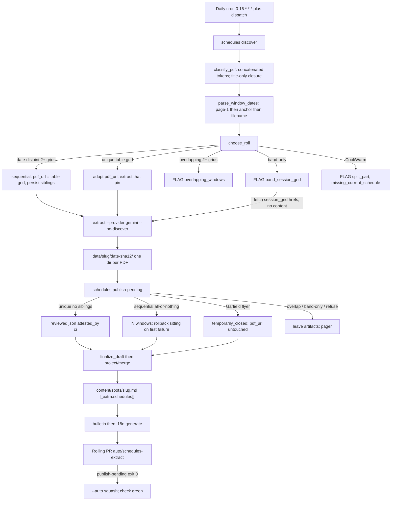
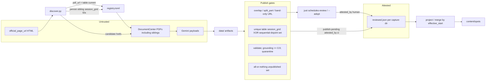

# Sequential-Window Ingest, Classifier Robustness, and Persist-Across-Adopt

**Author:** TBD
**Date:** 2026-08-20
**Status:** Draft
**Audience:** Operators of the schedule extract/review pipeline; engineers implementing after Key Decisions are approved

This is the spec after unique-grid auto-publish ([`docs/specs/2026-08-20-schedule-auto-publish.md`](docs/specs/2026-08-20-schedule-auto-publish.md)). It closes that spec's Open Questions 1–2 for sequential windows, and it fixes classifier and persist bugs that keep FLAG pools dark after unique grids already ship.

Do not implement until the operator approves Key Decisions.

---

## Overview

Unique table `session_grid` auto-publish is live (PR #39, 2026-08-20T18:46Z). Coffman, Hamilton, and Mission are on the board. Rec & Park still posts **two whole-pool PDFs for one season** at Sava, MLK, and Balboa. Discover FLAGs `multiple_windows`, `publish-pending` refuses `discovery_flagged`, and the board keeps the last reviewed summer window (POST_SEASON). Adopting only the table-linked file is a 10-day trap.

Three defects make FLAG worse than the auto-publish spec assumed:

1. **`choose_roll` short-circuits** to `unchanged` when the current pin is already a `session_grid`, even if siblings exist. After `--adopt` of Sava 29815, Fall 2 (29805) disappears from the next discover pass.
2. **`--adopt` destroys persist.** `persisted_band_ids` reads the `discover:` notes line. `_apply_decision_to_block` clears that line on adopt of a `session_grid`. 29805 then sits below `max_id` and is not re-GETed.
3. **Rossi 29804 is a real fall grid** titled `ROSSI POOL FALL 2026 SCHEDULE (August 16–December 10)`. Concatenated filename `RossiPool_…` fails the pool token. Page-1 `"Closed every 4th Thursday"` then matches `_CLOSURE_RE` and the unique-table closure path refuses `closure_dates_unparsed`.

This design cuts over three things. Classify concatenated pool names and do not let body "closed" cells demote a Fall/Schedule title. Persist sibling `session_grid` IDs across `--adopt` and `max_id` jumps. Ingest date-disjoint sequential windows as two `[[extra.schedules]]` tables in one sitting (all-or-nothing), with `pdf_url` tracking the table-linked current file. CI extracts those View IDs without a local Gemini laptop. Overlapping Cool/Warm stays FLAG. Band-only unlinked grids stay `--adopt`. Extract still does not write `content/spots/`.

---

## Background & Motivation

### What auto-publish already shipped (do not redo)

- Unique table `session_grid` → `publish-pending` → `reviewed.json` `attested_by: ci` → `project()` → rolling PR auto-merges on green `check`.
- Extract never writes `content/spots/`.
- Unique table `closure_notice` with parseable dates auto-projects `temporarily_closed`. Flyer is not put on `pdf_url`.
- FLAG URL choice was explicitly not that slice. `just schedules-review` remains for FLAG adopt and repair.
- CI regenerates i18n after bulletin so `generate-i18n.mjs check` does not block auto-merge.
- Discover tests copy `tests/fixtures/discover/registry.toml`, not live seasonal IDs.

Auto-publish Non-goals / Open Questions 1–2 named dual-window ingest and split-PDF extract as later PRs. This spec is that dual-window ingest, plus the classifier and persist bugs that the first sitting exposed.

### Live FLAG set (verified 2026-08-20)

Verified by `schedules discover --dry-run` plus reading PDF page-1 text. The public board that day: Coffman/Hamilton Aug 18–Dec 12; Mission Aug 18–Oct 17; Garfield closed Aug 14–Sep 7 (flyer 29808); North Beach interim Aug 11–29 already live (manually reviewed Cool+Warm). Sava, Balboa, MLK POST_SEASON after Aug 15. Rossi POST_SEASON after Aug 13.

| Pool | Why FLAG | Files | PDF header (truth) | Board 2026-08-20 |
|---|---|---|---|---|
| Balboa | `multiple_windows` | table 29797; persisted 29796 | 29797 INTERIM Aug 11–29; 29796 FALL Sep 1–Dec 12 | POST_SEASON Aug 15. Adopting only 29797 is a 10-day trap. |
| Sava | `multiple_windows` | table 29815; band 29805, 29806 | 29815 and 29806 both FALL Aug 18–28 (filename 29815 said Aug18toDec26 — **filename lies**); 29805 FALL Aug 29–Dec 12 | POST_SEASON Aug 15. Current window is Fall 1. Fall 2 starts Aug 29. |
| MLK | `multiple_windows` | table 29802; band 29803 | pt.1 Aug 18–Sep 26; pt.2 Sep 29–Dec 12 | POST_SEASON Aug 15. Sequential windows, **not** Cool/Warm. Classifier already treats these as `session_grid` (`_SPLIT_RE` is Cool/Warm only). |
| Garfield | `band_session_grid` | table 29808 flyer; persisted 29799 | 29808 maintenance Aug 14–Sep 7 (already auto-published); 29799 FALL Sep 8–Dec 10 unlinked | Closed through Sep 7. After Sep 7 → POST_SEASON unless 29799 is ingested. Spec still forbids auto-rolling `pdf_url` to a band-only file Rec & Park has not linked. |
| Rossi | `closure_notice` | table 29804 | **ROSSI POOL FALL 2026 SCHEDULE (August 16–December 10)** — a real weekday grid | POST_SEASON Aug 13. Misclassified. |
| North Beach | `split_part` | table 29778 Cool + 29779 Warm | both Summer Interim Aug 11–29 | Already live through Aug 29. Do not adopt a part. After Aug 29 → POST_SEASON until a combined whole-pool PDF. |

Grounding check against today's tree (do not treat local `registry.toml` notes as the FLAG truth):

- Rossi 29804 is pinned, notes say `flag closure_notice`, Gemini already extracted Aug 16–Dec 10 at `data/rossi-pool/2026-08-20-cb8abdbbedda/` (grounding 1.0, no `reviewed.json`).
- Sava 29815 is pinned with **no** sibling notes. Gemini extracted Aug 18–28 (header truth, not the filename) at `data/sava-pool/2026-08-20-284b2d47d683/` (grounding 1.0, no `reviewed.json`). 29805 is not persisted.
- MLK 29802 is pinned with no sibling notes. Gemini extracted Aug 18–Sep 26 at `data/martin-luther-king-jr-pool/2026-08-20-838c12e25ad1/` (**grounding 3/27 = 0.11**, no `reviewed.json`). 29803 is not persisted. Sequential all-or-nothing will refuse the sitting even if 29803 extracts clean.
- Balboa 29797 is pinned with no sibling notes. Gemini extracted Aug 11–29 at `data/balboa-pool/2026-08-20-d20965597a7a/` (**grounding 14/23 ≈ 0.61**, no `reviewed.json`). 29796 is not persisted.
- Garfield `pdf_url` in this working tree is already 29799 from a local `--adopt`; closure 29808 is CI-attested; fall grid extract exists at `data/garfield-pool/2026-08-20-7f5c0074e8dd/` (Sep 8–Dec 10).
- North Beach remains `missing_current_schedule` with Cool 29778 + Warm 29779.

The working-tree pins are the short-circuit + persist-destroyed-by-adopt bugs in production form. The 2026-08-20 dry-run table is the product truth this spec restores.

### Root causes (verified in code)

#### 1. Sequential windows vs one `pdf_url`

`choose_roll` (`schedule-tools/src/schedules/discover.py`) FLAGs when `len(all_grid_ids) >= 2` and the current pin is **not** among them (`reason="multiple_windows"`, `blocking=True`, `source_status` stays `published`). `publish_eligible` then refuses `discovery_flagged` when `candidate.slug in blocking_slugs`. The unique-grid path never sees the fall captures. Dual-window ingest was auto-publish Open Question 1.

#### 2. `choose_roll` short-circuit

```243:251:schedule-tools/src/schedules/discover.py
    if current_id is not None and current_id in all_grid_ids:
        return decide(
            "unchanged",
            "current_session_grid",
            kind="session_grid",
            new_url=old_url,
            blocking=False,
            extra=non_grid,
        )
```

This runs **before** the `len(all_grid_ids) >= 2` branch. After `--adopt` of Fall 1, later discover no longer FLAGs Fall 2. Covered today by `test_choose_roll_unchanged_when_current_is_classified_session_grid` (Garfield 29799 + flyer extra only — no sibling grid). The Sava case is untested.

#### 3. Persist is destroyed by `--adopt`

`persisted_band_ids` parses the leading `discover:` line (`flag` or `adopt` verbs; `band`/`persisted` sources). `_operator_adopt_decision` puts only **non-grid** siblings on `extra_candidates`. `_desired_machine_line` for `adopt`/`unchanged` then either writes `_off_table_current_grids` (the **adopted** id if it is band/persisted) or **returns `None` and clears the line**.

After `just schedules discover --adopt sava-pool=29815`, 29805 is gone. Next cron `max_id` is at least 29815. 29805 is below the forward band and is not persisted. Fall 2 is invisible unless Rec & Park still links it on the facility table.

`test_discover_all_operator_adopt` asserts 29815 is pinned and `published`. It does not assert 29805 remains on the notes line.

#### 4. Filename is not the window

Sava 29815 filename: `Sava_Pool_Fall12026_Aug18toDec26_`. Page-1 header and Gemini payload: Aug 18–28. Date overlap / header parse must beat filename when they conflict. Otherwise discover will treat Fall 1 as overlapping Fall 2 (Aug 29–Dec 12) and FLAG them as Cool/Warm-like.

#### 5. Rossi classifier bug

`_token_re` compiles `(?i)(?<![a-z]){body}(?![a-z])`. Under `(?i)`, `[a-z]` matches `P`, so `RossiPool` does not match token `Rossi`. First pass on filename/anchor is `other`. Second pass concatenates page-1 text into the haystack (`classify_pdf` lines 171–181). `_classify_kind` runs `_CLOSURE_RE` **before** pool+season:

```47:49:schedule-tools/src/schedules/discover.py
_CLOSURE_RE = re.compile(
    r"(?i)(?<![a-z])(?:maintenance|closure|closed|notice|repair|attention)(?![a-z])"
)
```

`"Closed every 4th Thursday"` wins. Kind becomes `closure_notice`. Unique-table closure path calls `parse_closure_dates` on `RossiPool_Fall2026_Aug16toDec10` → `closure_dates_unparsed`. Board stays dark. Gemini already extracted a valid fall grid (grounding 1.0).

#### 6–7. Garfield band-only and North Beach Cool/Warm

Garfield 29799 is correct FLAG: Rec & Park has not linked it. Operator `--adopt 29799` remains the URL confirmation. North Beach Cool+Warm are parallel files for the same days, not sequential. `_SPLIT_RE` already catches them. Split extract is not this slice. `--adopt` of `split_part` must still not set `published`.

#### 8. Review queue is empty until adopt+extract

`find_review_candidates` lists dirs with provider JSON and no `reviewed.json`. `ReviewApp.candidates` then **drops** any dir that is not git-changed vs `origin/main` / working tree (`review_server.py` `_changed_review_dirs`). Committed FLAG extracts on `main` (Rossi, Sava, Balboa, MLK 2026-08-20) are invisible. `just schedules-review` prints `nothing to review` while FLAG notes exist. Local `GOOGLE_API_KEY` was missing from `.env` (CI has the secret; 1Password has "Gemini API Key"). The operator is currently a required Gemini laptop.

#### 9. One envelope per capture dir

`project()` / `merge()` already append or replace `[[extra.schedules]]` by `effective_start`. `pick_active_schedule` already picks in-window, else upcoming, else past. Sequential windows are two tables in one spot file. Dual `pdf_url` / `pdf_urls[]` in TOML stays forbidden (auto-publish and discovery specs).

#### 10. i18n / seasonal test pins

Patched in #39. Incident lessons only. Residual: do not re-pin live DocumentCenter IDs in `tests/test_discover.py`. `tests/test_site_render.py` reads active windows from content; it does not pin fall 2026 IDs.

### Why this is still a workflow gap

Gemini already extracted Rossi, Sava Fall 1, MLK pt.1, and Balboa interim. The model is not the hole. Classification, persist, sibling fetch, and all-or-nothing publish are the hole. Rec & Park history: almost always one current schedule file per pool/season; sequential replacements at Coffman/Mission/Sava; North Beach Cool+Warm only this interim. Do not map static "tanks." Use date overlap vs Cool/Warm to distinguish sequential windows from splits.

---

## Goals & Non-Goals

### Goals

- Ingest date-disjoint sequential `session_grid` PDFs as two (or more) `[[extra.schedules]]` tables in one sitting. All-or-nothing: if either unpublished window fails a publish gate, publish none of the unpublished windows.
- Keep one `pdf_url` per pool. It tracks the Documents-table `session_grid` Rec & Park is showing now.
- Persist sibling `session_grid` IDs across `--adopt`, unique adopt, sequential ingest, and `max_id` jumps. Drop a persisted ID only on HTTP 404 or after it is the current `pdf_url` **and** no other sibling remains (still re-GET until 404; see Proposed Design).
- Classify concatenated pool tokens (`RossiPool`, `Sava_Pool`). Do not let page-1 body "closed" cells demote a Fall/Schedule title to `closure_notice`.
- Parse window dates from PDF page-1 header, then anchor, then filename. Header wins when they disagree.
- CI extracts every classified `session_grid` candidate listed on the discover decision (table, band, persisted) via `fetch_pdf(slug, href)`. No workflow `--url` / `--adopt`. Operator is not a required Gemini laptop.
- Unique-grid `publish-pending` must refuse a slug that still has sibling `session_grid` IDs, so Fall 1 cannot ship alone. Unique-grid also binds the capture View ID to the current `pdf_url`.
- `just schedules-review` must show Rec & Park FLAG captures that sit on `main` **without** reopening May leftovers or collapsing two sequential windows into one Save card. Human sequential Save is all-or-nothing (minus the 0.9 floor); per-card Save must not `project()`.
- Leave North Beach Cool/Warm FLAG until a combined whole-pool PDF. `--adopt` of `split_part` still does not set `published`.
- Keep extract from writing `content/spots/`. `publish-pending` / human Save still publish.
- Page remaining FLAG and sequential refuses on issue `schedules flagged` (#43). Successful sequential publish comments `schedules published`.

### Non-goals

- Split-PDF extract (Cool + Warm into one payload with `pool` tags). Later PR.
- Auto-rolling `pdf_url` to a band-only file Rec & Park has not linked (Garfield 29799). `--adopt` stays.
- Dual `pdf_url` / `pdf_urls[]` in `registry.toml`. Dual envelope files.
- Putting a flyer on `pdf_url`.
- Weakening `GROUNDING_MIN_RATIO = 0.9` (Balboa 29797 is currently 0.61; MLK 29802 is 0.11; those sittings stay human Save or a later `--force` re-extract, not a floor change).
- Direct/HTML auto-publish.
- A pending-review chip, a second rolling branch, Slack, Playwright, CivicPlus listing/API.
- Semantic PDF identity. Byte SHA stays identity.
- Changing `pick_active_schedule` / POST_SEASON copy except insofar as real projected windows exist.
- Re-litigating i18n generate or fixture registry pins from #39.

---

## Key Decisions

These resolve the three counsel lenses (product/board, pipeline/CI, extract/classifier) and questions A–I. Each is a cut-over, not a shim. Approve these before implementation.

### A. Sequential windows: ingest both in one sitting

**Decision.** When a Rec & Park pool has **two or more** classified `session_grid` IDs whose parsed windows are **date-disjoint**, CI extracts every ID and `publish-pending` projects every unpublished window into `[[extra.schedules]]` in one sitting. If any unpublished window fails a gate, project **none** of them (all-or-nothing). Already-attested windows for that slug are not unpublished.

Adopt-current-only is the 10-day trap (Balboa 29797, Sava 29815). Operator `--adopt` forever leaves the board dark until a laptop sitting. Historical Rec & Park files are sequential replacements, not parallel tanks.

**Date-disjoint.** Inclusive ranges `[start, end]`. Adjacent days are disjoint (Sava Aug 18–28 and Aug 29–Dec 12; Garfield closed through Sep 7 and fall Sep 8; MLK Aug 18–Sep 26 and Sep 29–Dec 12). Same-day overlap is overlap. Every pair in a set of 3+ must be disjoint.

**If any candidate window is unparseable at discover time:** FLAG `windows_unparsed` (blocking). Do not guess sequential. Do not name this `overlapping_windows` — that reason is Cool/Warm-like overlap and would make operators treat Sava as a split.

**If payload dates after extract overlap** (header parse was wrong): refuse `overlapping_windows`, publish none of the unpublished set.

Applies to Sava 29815+29805, MLK 29802+29803, Balboa 29797+29796. Sava 29806 is the same window as 29815 (both Aug 18–28): **collapse equal ranges in discover before extract.** Keep the table-linked ID as the window. Persist the duplicate View ID until 404 (`session_grid` / `persisted`, not `extra`). Fetch one href per window (table id preferred). Do not FLAG equal-range copies as overlap. Do not Gemini the duplicate.

Sequential ingest runs only when every pair is date-disjoint **or** an equal-range copy of a kept ID.

### B. `pdf_url` is the table-linked current file

**Decision.** One `pdf_url`. It tracks the Documents-table `session_grid` Rec & Park is showing now.

- Exactly one table `session_grid` among a sequential set → that ID is `pdf_url`, even if siblings exist in band/persist.
- If the pin is already that ID → leave it (`unchanged`).
- If the pin is a sibling (operator `--adopt`ed Fall 2 while the table still shows Fall 1) → roll back to the table ID on the next discover pass. Persist the adopted sibling. Table wins for the pointer; ingest still sees both.
- Zero table `session_grid` and 2+ band/persisted grids → do **not** pick. FLAG `band_session_grid` (Garfield shape).
- Two or more **table** `session_grid` IDs that are date-disjoint (Sava when Fall 1 and Fall 2 are both on the table) → table still wins. Among table grids, pick the one whose window contains Pacific today; else the table grid with the earliest upcoming `window_start`; else table order (first listed). Still not newest-start (Balboa's table file is the short current window).
- Two or more **table** `session_grid` IDs that overlap → FLAG `overlapping_windows`. Classify should already have marked Cool/Warm as `split_part`.
- Do not leave a summer pin when a table fall/interim grid exists.
- Do not set `pdf_url` to the newest `effective_start`.

Provenance of prior URLs stays in git and `reviewed.json.source_pdf_url`. No `pdf_urls[]`.

### C. Persist sibling `session_grid` IDs across `--adopt` and `max_id` jumps

**Decision.** One machine-line grammar. Cut over; do not keep today's writer plus a parallel `sequential_windows` verb.

```
discover: {date} {action} {reason} {id tokens}
```

`action` is `adopt` | `unchanged` | `flag`. `reason` is `sequential_windows` | `windows_unparsed` | `overlapping_windows` | `band_session_grid` | `session_grid` | `split_part` | … `id tokens` **always list every non-pin `session_grid`** (`band_session_grid id=N:session_grid:band` / `:persisted`, and a table sibling that is not the pin). The pin may also be listed (`id=29815:session_grid:table`) for humans; persist does not require it.

`persisted_band_ids` accepts **every verb except `extra`**. Parse `id=<digits>:session_grid:(band|persisted)` and any listed non-pin table sibling recorded as `persisted` on the next rewrite. Today's allowlist (`flag`/`adopt` only) and today's writer (`_off_table_current_grids` only, then clear) are the bug.

Sava after `--adopt` of table 29815, sibling 29805 still off-table:

```
discover: 2026-08-20 unchanged sequential_windows id=29815:session_grid:table band_session_grid id=29805:session_grid:band
```

If that sitting **rolls** the pin: `action` is `adopt`, same reason and tokens. Verb is never `sequential_windows`.

Re-GET persisted IDs every pass even when they sit below `max_id`. Drop only on HTTP 404.

Persist notes without the `choose_roll` reorder do **not** restore Fall 2: `current_id in all_grid_ids` still returns `unchanged` first. The persist PR **must** change `choose_roll` order and persist together, and must refuse unique-grid `sibling_session_grids`. Do not split those.

`--adopt` of a `session_grid` still sets `published` and still writes `pdf_url`. It no longer clears sibling persist.

`--adopt` of a `split_part` is unchanged: do not set `published`; do not extract parts.

### D. Rossi-class bugs: concatenated tokens; title-only closure

**Decision (tokens).** Pool-token match must accept concatenated identifiers. `_token_re` stays case-insensitive on the name body and **case-sensitive** on the trailing-letter guard so `RossiPool` and `Sava_Pool` match `Rossi` / `Sava`, while `Rossian` does not.

Python `(?i)(?![a-z])` makes `[a-z]` match `P`. Cut over to an explicit ASCII-letter lookbehind and a `(?-i:…)` lookahead:

```python
def _token_re(token: str) -> re.Pattern[str]:
    parts = [re.escape(part) for part in token.split() if part]
    body = r"\s+".join(parts)
    return re.compile(rf"(?i)(?<![A-Za-z]){body}(?-i:(?![a-z]))")
```

Apply the **same** trailing-letter guard to `_SPLIT_RE` and `_SEASON_RE`. Under `(?i)`, `CoolPool` does not match `Cool` and would fall through to `session_grid`; overlap FLAG is a safety net, not the classifier. `Fall2026` already matches `_SEASON_RE` because `2` is not a letter; still cut the lookaround over so the three regexes do not drift. Fixture `CoolPool` / `WarmPool` concatenated names as `split_part`.

**Decision (closure).** `_CLOSURE_RE` runs only against **filename + anchor text** (`primary`). Page-1 body is used to promote `other` → `session_grid` when pool+season (or a grid header plus pool tokens) match. Page-1 `"Closed every 4th Thursday"` must not demote a Fall/Schedule title.

Existing rule kept: a **title** that is a maintenance flyer (`Garfield Pool Maintenance Closure 8-14_9-7 2026`) stays `closure_notice` even if page 1 has weekday tokens. Grid header still does not remove a closure classification of `primary`.

**Rossi ships on the token fix.** `classify_pdf` runs `_classify_kind` on `primary` first. `RossiPool_Fall2026_Aug16toDec10.pdf` matches `Rossi` and `Fall` on primary → `session_grid`; page-1 is not consulted. Unique-grid auto-publish of the 2026-08-20 capture (grounding 1.0, `schedule_basis=swim_schedule`) is the intended product outcome, not a flyer. The closure path requires no table `session_grid` and will not run. Title-only `_CLOSURE_RE` is still required for grids whose filename lacks a season token. Land token match and title-only closure in **one** classifier PR.

### E. Garfield 29799: keep `--adopt` for URL roll

**Decision.** Do not auto-roll `pdf_url` to a band-only `session_grid`. Rec & Park has not linked 29799. It may be a draft. `--adopt garfield-pool=29799` remains the confirmation.

CI **may extract** 29799 by View ID while it is FLAG (Decision I) so the operator does not need a Gemini laptop after `--adopt`. Extract-ahead writes provider JSON, not `reviewed.json`. Unique-grid stays refused while `band_session_grid` is blocking **and** while the candidate View ID is not the current `pdf_url`. After `--adopt`, the next CI pass is `unchanged` on that pin and unique-grid auto-publish may project it. Dates do not overlap the already-published closure (closed through Sep 7, fall starts Sep 8). Gate 13 (`effective_start` vs `max(effective_start)` over all windows) passes because Sep 8 > Aug 14.

Human Save of 29799 is **not** URL confirmation. `--adopt` is. Hide `band_session_grid` extracts from the review queue until `pdf_url` is that ID (Review queue decision).

Do **not** add a special "unlinked grid + published closure ⇒ auto-project" path. That is a second publication predicate for one pool.

### F. North Beach: leave FLAG until a combined PDF

**Decision.** Cool/Warm are parallel files for the same days. Not sequential. Split extract is not this slice. Discover keeps `missing_current_schedule`. Extract stays skipped. `--adopt` of a `split_part` writes `pdf_url` and must **not** set `published`. A later combined whole-pool `session_grid` `--adopt` does set `published`.

Date overlap is the safety net if Cool/Warm tokens are missing: two `session_grid` IDs with overlapping ranges FLAG `overlapping_windows` and do not auto-publish a part.

### G. Who publishes sequential windows: `publish-pending` (CI attestation)

**Decision.** Sequential windows are two unique grids that are date-disjoint. `publish-pending` attests them (`attested_by: ci`) with the same gates as unique-grid (validate, grounding ≥ 0.9, quarantine, merge baseline, `source.pdf` present, not `temporarily_closed` unless that is the payload), **minus** the blanket `discovery_flagged` refuse, **plus**:

- sibling set size ≥ 2 classified `session_grid` IDs (after equal-range collapse)
- discover-time windows disjoint (and payload windows disjoint); unparseable is `windows_unparsed`, not overlap
- all-or-nothing on unpublished captures: **pre-validate every window, write only if all pass**
- unique-grid loop **skips** sequential slugs **and** (unique-grid only) refuses `sibling_session_grids` so Fall 1 cannot ship alone if order slips
- unique-grid only also refuses unless the candidate View ID is the current `pdf_url` (`not_current_pin`)

**`sibling_session_grids` and `not_current_pin` must not run on sequential pre-validate.** Sava after Decision B: `pdf_url` is table 29815; Fall 2 (29805) is a sibling, so View ID ≠ pin. Running those gates on 29805 would refuse the sitting and never light Sava, MLK, or Balboa. They belong on `_publish_unique_grid` (or `publish_eligible(..., require_unique_pin=True)` that sequential sitting does not pass). Sequential pre-validate uses grounding, validate, quarantine, `source.pdf`, basis, identity, merge baseline, and the sequential disjoint / completeness checks only.

Human Save-all is the same all-or-nothing sitting as CI, **minus the 0.9 grounding floor**, writing the **POSTed envelopes** (Balboa 29797 at 0.61 and MLK 29802 at 0.11). Per-card sequential confirm must not write `reviewed.json` or `project()`. Ordinary Save+project stays for Hamilton-class unique-grid. Kill switch `SCHEDULES_AUTO_PROJECT=false` still skips `publish-pending`.

If dates overlap, FLAG `overlapping_windows`. That is Cool/Warm. Keep the 0.9 grounding floor. The first sequential morning does **not** light MLK or Balboa if those extracts stay below 0.9.

### H. Filename vs PDF header dates

**Decision.** Parse window dates in this search order; first successful parse wins:

1. PDF page-1 text (first ~40 non-empty lines via existing `extract_page_texts`)
2. Documents-table `anchor_text`
3. `Content-Disposition` filename

Sava 29815 is the worked example: filename `Aug18toDec26`, header Aug 18–28. Header wins.

Relocate `parse_closure_dates` month maps **and extend them in the same PR**. Today's `_MONTHS` is full names only (`august`, `september`). `_MONTH_TO_MONTH_RE` / `_SAME_MONTH_RANGE_RE` will parse page-1 `August 18–28`. They will **not** parse `Aug18toDec26`, `Aug 18_Sep26`, `Aug18_toOct17`, or `Sept 8 to Dec 10`. Relocate-without-extend FLAGs Sava `windows_unparsed` and sequential ingest never runs.

**Alias table** (case-insensitive; `Sept` and `Sep` both map to September):

| Abbrev | Month |
|---|---|
| `jan` | January |
| `feb` | February |
| `mar` | March |
| `apr` | April |
| `may` | May |
| `jun` | June |
| `jul` | July |
| `aug` | August |
| `sep` / `sept` | September |
| `oct` | October |
| `nov` | November |
| `dec` | December |

**Extra regexes** (in addition to existing `8-14_9-7`, `August 18 to December 10`, `August 18–28`):

| Pattern | Example |
|---|---|
| `MonDDtoMonDD` (no spaces) | `Aug18toDec26` |
| `Mon DD_MonDD` | `Aug 18_Sep26` |
| `MonDD_toMonDD` | `Aug18_toOct17` |
| aliased `Mon D to Mon D` | `Sept 8 to Dec 10` |

Trailing junk (`Aug18toDec26_`) is allowed after the range. Year from the matched token, else from a nearby `20\d{2}` on the same string, else Pacific today's year. End before start in the same year is unparseable (not a year wrap). Fixture **every** row in the window-dates table.

Discover uses this parse to distinguish sequential vs overlapping **before** extract. `publish-pending` uses Gemini `payload.effective_start` / `effective_end` as the publication window and as the second overlap check. Payload beats discover parse if they disagree.

### I. CI extracts FLAG `session_grid` candidates without rolling `pdf_url`

**Decision.** After `schedules discover` writes `tmp/discovery-decisions.json`, the existing Gemini extract step (`extract --provider gemini --no-discover`) fetches **one href per collapsed window** from that slug's decision, not only `entry.pdf_url`. Implementation is library-side inside `run_pipeline` / `_process_entry` (`fetch_pdf(slug, href)`). Workflow YAML still does not pass `--url` or `--adopt`. Equal-range duplicates are not fetched (Decision A). Table id is preferred when several IDs share a window.

- `split_part` IDs are not extracted.
- `closure_notice` stays on the `publish-pending` flyer path.
- `source_status == missing_current_schedule` still skips the pool.
- Extract still does not write `content/spots/` or `registry.toml`.
- One envelope per capture dir (`data/<slug>/<date>-<sha12>/`) already. Two **windows** ⇒ two dirs.
- `GOOGLE_API_KEY` is the CI secret. Local extract remains available; it is not required for FLAG ingest.

This is the cut-over for "operator is not a required Gemini laptop." Combined with Decision C, `--adopt garfield-pool=29799` then the next cron can unique-grid publish without a local provider key. Extract-ahead of 29799 does not auto-publish (blocking + `not_current_pin`) and does not join the review queue until `--adopt`.

### Review queue: newer-than-latest-reviewed; sequential lists every window; hide band-only until `--adopt`

**Decision.** Replace the `origin/main` git-changed-dir **gate**. Do not keep latest-by-slug alone.

1. Start from `find_review_candidates` (provider JSON, no `reviewed.json`).
2. Drop a dir whose fetch date is **older than** the slug's latest `reviewed.json` dir. If the slug has no `reviewed.json`, keep remaining unreviewed dirs that pass the other filters. This hides May leftovers that have a later reviewed capture (`data/koret-center/2026-07-10-47b0c41acd2b`, `24-hour-fitness-ocean/2026-05-17-bfc2cfde9340`, `chinatown-ymca/2026-05-17-54f49481ad6f`, `embarcadero-ymca/2026-05-17-f0aea00d396f`, `jccsf/2026-05-17-02f5bb08d901`, `pomeroy-pool/2026-05-17-846bfed69445`, `sfsu-mashouf/2026-05-17-26d5584d5adb`, both `stonestown-ymca/2026-05-17-*`). `data/sava-pool/2026-04-19-*` has no provider JSON and still does not join.
3. Hide `band_session_grid` extracts whose View ID is not the current `pdf_url`. Human Save of Garfield 29799 is **not** URL confirmation. `--adopt` is.
4. Default (no sibling `session_grid` set): latest-by-slug among remaining. One card per slug. HTML/direct behavior unchanged.
5. Sequential / sibling-grid slugs (`≥2 session_grid` IDs on the discover decision after equal-range collapse): list **every** remaining unpublished `session_grid` capture. The UI/API addresses them by `slug` + sha12 (or review dir), not slug alone. `latest_by_slug` collapsing Balboa 29797 and 29796 into one card is the 10-day trap on the human path.

**Human sequential Save is the same all-or-nothing sitting as CI, minus `GROUNDING_MIN_RATIO`, using the POSTed envelopes.** Today's `ReviewApp.save` projects one dir via `finalize_draft`. Today's `publish_candidate` always `draft_envelope` from provider JSON. After a CI `sequential_partial`, both dirs are unpublished. Per-card Save of either is circular if it refuses, and the 10-day trap if it `project()`s. Rubber-stamping provider JSON would drop UI cell edits on Balboa 0.61 / MLK 0.11.

Cut over:

- Completeness is keyed off the discover **kept-window set**, not only dirs on disk. If the decision has ≥2 kept windows and this sitting would leave the set incomplete (a kept View ID has no unpublished-or-attested capture, or an unpublished kept window is not in this Save), refuse `sequential_incomplete`. That covers Save of 29815 while 29805 is on the notes line but not extracted.
- The UI shows every unpublished kept-window card. Operator edits and confirms **all** of them. Per-card confirm is **UI-only**: no `reviewed.json`, no `project()`. If it wrote `reviewed.json`, `find_review_candidates` would drop that dir and Save-all would never project the first window.
- **One** Save-all POST then runs `publish_sequential_slug(..., attested_by="human", require_grounding=False, envelopes={sha12: envelope})`. Write the **POSTed** envelopes (`attested_by: human`) into each dir and `finalize_draft` those files all-or-nothing (markdown backup, unlink every `reviewed.json` on failure). **Do not call `draft_envelope` on the human path.** CI sitting still drafts from provider JSON when `envelopes` is omitted.
- Do **not** add `allow_partial_sequential`. Recovery sitting already publishes the remaining unpublished window when every other kept window has `reviewed.json`. A flag that skips completeness while a sibling is listed and unattested is the 10-day trap. Happy path is Save-all only.
- `GET` / `check_source` / `refresh` / `/source/` for Rec & Park sibling cards use `slug` + sha12. `refresh` and `current_source_identity` fetch **that capture's** `source_pdf_url`, not `entry.pdf_url`. Refresh of Fall 2 while the pin is Fall 1 must not `--force` extract 29815. Band-only 29799 still fails identity until `--adopt` sets `pdf_url`.
- **Keep ordinary Save+project** for non-sequential slugs: `POST /api/reviews/{slug}` (HTML/direct and unique-grid Rec & Park repair, e.g. Hamilton). Sequential slugs reject that POST (`sequential_incomplete`) and do not `project()` from it.

Do not merge the review-queue PR before sequential ingest (PR 4) **and** persist (PR 2). Opening FLAG dirs on `main` before sibling extract exists would leave one Fall 1 card.

### What this reverses from prior specs

| Prior rule | After this spec |
|---|---|
| Auto-publish OQ 1: dual-window ingest is a later PR. FLAG both Sava IDs; `pdf_url` stays summer until `--adopt`. | Date-disjoint sequential windows ingest both. `pdf_url` tracks the table-linked current file. |
| Auto-publish OQ 2: split-PDF extract later; MLK pt.1/pt.2 belong with Sava. | MLK is sequential ingest (this spec). North Beach Cool/Warm stays later. |
| Discovery KD 6: 2+ session-grid windows FLAG, leave `published`, leave `pdf_url`. | 2+ **overlapping** still FLAG. 2+ **disjoint** roll `pdf_url` to the table grid and ingest both. |
| Discovery: `--adopt` of a `session_grid` clears the blocking `discover:` line. | `--adopt` persists remaining sibling `session_grid` IDs. |
| `choose_roll`: current ID in `all_grid_ids` ⇒ `unchanged` even with siblings. | Siblings force sequential vs overlap. `unchanged` only when the pin is the sole `session_grid`. |
| Extract fetches only `entry.pdf_url`. | Extract fetches one href per collapsed window. |
| `ReviewApp.candidates` git-changed-dir filter. | Newer-than-latest-reviewed; sequential lists every window; hide band-only until `--adopt`; Save-all sitting minus grounding floor. |

---

## Proposed Design

### Architecture



### Trust boundary

Unchanged from auto-publish: extract never writes `content/spots/`. Sequential ingest is a `publish-pending` sitting, not a second projector. Human Save remains the override. Carry-forward unchanged.



### Classifier cut-over

Order inside `_classify_kind` / `classify_pdf` after this spec:

1. Non-PDF → `other`.
2. Other pool's tokens, not this pool's → `other`.
3. `_CLOSURE_RE` on **primary only** (filename + anchor) → `closure_notice`. Stop. Page-1 weekday tokens do not demote.
4. `_SPLIT_RE` (Cool/Warm only, concatenated-name aware) on primary **or** page-1 title lines → `split_part`. `CoolPool` / `WarmPool` match.
5. This pool's tokens (concatenated-name aware) **and** `_SEASON_RE` (same lookaround guard) on primary → `session_grid`.
6. Else if `other` and PDF bytes: page-1 text may **promote** to `session_grid` when pool+season match, or when pool tokens + `_has_grid_header`. Page-1 is **not** searched for `_CLOSURE_RE`.
7. Else `other`.

Rossi 29804: filename `RossiPool_Fall2026_Aug16toDec10.pdf` matches token `Rossi` and `Fall` on primary → `session_grid` on pass 5. Page-1 is not consulted for closure.

Garfield 29808: primary contains `Maintenance Closure` → `closure_notice` on pass 3.

### Window date parse

New helper, used by discover (pre-extract) and tests. Relocate `publish.py` month maps and range patterns into `schedules/window_dates.py` (or keep them next to `parse_closure_dates` and import from discover) **and add the alias table plus extra regexes in that same PR**. Relocate-without-extend misses `Aug18toDec26` / `Sept`. `publish.py` keeps using payload dates for the second overlap check.

Filename and header forms Rec & Park uses (must fixture **every** row):

| Example | Result |
|---|---|
| `Aug18toDec26` | 2026-08-18 .. 2026-12-26 (filename; header should beat this) |
| page-1 `August 18–28` / `August 18-28` plus nearby `2026` | 2026-08-18 .. 2026-08-28 |
| `Aug 18_Sep26` | 2026-08-18 .. 2026-09-26 |
| `Aug18_toOct17` | 2026-08-18 .. 2026-10-17 |
| `Sept 8 to Dec 10` / `September 8 to December 10` | 2026-09-08 .. 2026-12-10 |
| `8-14_9-7 2026` | 2026-08-14 .. 2026-09-07 (already) |
| `Aug 11 to Aug 29` | 2026-08-11 .. 2026-08-29 |

`parse_window_dates(*, page_text, anchor_text, filename, year_default) -> tuple[date, date] | None`.

Attach the parsed range onto `ClassifiedDocument` as optional `window_start` / `window_end` (`datetime.date | None`). **`_classified_to_json` must emit them** (`YYYY-MM-DD` or `null`). `_render_report` must print parsed windows per candidate and, when page-1 and filename disagree, both values (Sava 29815: header Aug 18–28 vs filename Aug 18–Dec 26). Today's serializer (`discover.py` 1136–1144) does not emit `grid_confirmed` and will not emit window dates unless that function is updated in the window-dates PR. Payload dates still win at publish time.

### `choose_roll` order (replace, do not dual-track)

Evaluate in this order. Cite today's function at `discover.py` `choose_roll`.

1. `source_status != "published"` → `flag` (`split_part` / `unpublished`). No `pdf_url` write. Unchanged.
2. Two or more distinct `session_grid` IDs (after equal-range collapse: one window per `[start, end]`, table id preferred):
   - If **any** kept window is unparsed → `flag`, `reason="windows_unparsed"`, `blocking=True`. Persist all IDs. Leave `pdf_url`.
   - If any pair overlaps (ranges not equal) → `flag`, `reason="overlapping_windows"`, `blocking=True`. North Beach safety net if Cool/Warm tokens missed.
   - If every pair is disjoint, or extra IDs are equal-range copies of a kept ID:
     - Exactly one **table** `session_grid` → `adopt` that URL if `!= current`, else `unchanged`. `reason="sequential_windows"`. `blocking=False`. `extra_candidates` = non-grids only. Candidates list every `session_grid` including equal-range duplicates (persisted, not extracted).
     - Zero table `session_grid` → `flag`, `reason="band_session_grid"`, `blocking=True`. Do not pick among unlinked files.
     - Two or more **table** `session_grid` IDs that are date-disjoint → still `reason="sequential_windows"`, `blocking=False`. `pdf_url` = the table grid whose window contains Pacific today; else the table grid with earliest `window_start` that is upcoming; else table order. Persist the others. (Sava when both Fall 1 and Fall 2 are on the table.)
     - Two or more **table** `session_grid` IDs that overlap → `overlapping_windows` FLAG (should already be Cool/Warm `split_part` at classify time).
3. `current_id in all_grid_ids` and fewer than two `session_grid` IDs → `unchanged`, `current_session_grid` (today's `--adopt` survival, now only when there are no siblings).
4. Table `split_part` → `flag`, set `missing_current_schedule`.
5. Exactly one table `session_grid`, no band/persisted sibling → `adopt` / `unchanged` as today (`no_grid_header` still FLAGs).
6. Zero table `session_grid`, one or more band/persisted → `flag` `band_session_grid`.
7. Notice-only / empty / fetch_error → as today.

Step 2 **replaces** the current short-circuit. `test_choose_roll_unchanged_when_current_is_classified_session_grid` must gain a sibling-grid variant that is **not** `unchanged` without persist.

### Persist machine line

Cut over to Decision C's grammar. Upsert remains idempotent on the key ignoring the date token. `_desired_machine_line` for `adopt`/`unchanged` writes `discover: {date} {action} {reason} {tokens}` with **every non-pin `session_grid`**, not `_off_table_current_grids` then clear.

Sava fixture (exact; `action` is `unchanged` or `adopt`, verb is never `sequential_windows`):

```
discover: 2026-08-20 unchanged sequential_windows id=29815:session_grid:table band_session_grid id=29805:session_grid:band
```

Other examples:

```
discover: 2026-08-20 adopt sequential_windows id=29815:session_grid:table band_session_grid id=29805:session_grid:band
discover: 2026-08-20 flag windows_unparsed id=29815:session_grid:table band_session_grid id=29805:session_grid:band
discover: 2026-08-20 flag overlapping_windows id=29778:session_grid:table id=29779:session_grid:table
discover: 2026-08-20 flag band_session_grid id=29808:closure_notice:table band_session_grid id=29799:session_grid:band
```

Equal-range Sava 29806 stays on the line as `band_session_grid id=29806:session_grid:band` (or `:persisted`) until 404. It is not extracted.

`persisted_band_ids`: if the verb is `extra`, return empty. Otherwise parse `id=<digits>:session_grid:(band|persisted)` (and non-pin table siblings recorded as `persisted`).

`_operator_adopt_decision` must pass the full classified list as `candidates` (already does) and must **not** strip sibling `session_grid`s from the notes write.

If there are no siblings and no non-grid extras, the line may still clear (Hamilton unique grid). That is the quiet success case.

Required test: `--adopt sava-pool=29815` ⇒ notes contain `id=29805`; second `discover_all` with `max_id=29815` and 29805 **absent** from the table HTML still classifies 29805.

### Extract: sibling `session_grid` hrefs

`run_pipeline` already reloads the registry after local `discover_all` and attaches notes from `tmp/discovery-decisions.json`. Cut over the fetch list to **one href per collapsed window** (table id preferred). Equal-range duplicates are persisted, not fetched.

```python
def _session_grid_hrefs(entry: PoolEntry, decisions: list[dict]) -> list[str]:
    """One href per [window_start, window_end]. Table id wins ties.
    Equal-range copies are omitted. pdf_url is always included."""
    ...
```

For each href, `_process_entry(replace(entry, pdf_url=href), ...)`. Skip the whole slug when `source_status != "published"` (North Beach). Do not fetch `split_part` or `closure_notice` here. Test 29815+29806 as one window: one `fetch_pdf` for 29815, 29806 still on the persist line.

`fetch_pdf` already caches by SHA under `data/<slug>/<date>-<sha12>/`. Sibling IDs that were already extracted this morning cache-hit. Gemini runs only on new SHAs. Reviewed-snapshot fast path still applies per dir.

Cost: first sequential morning is +1 Gemini call per unpublished sibling (Sava 29805, MLK 29803, Balboa 29796; Rossi is unique-grid after D). Band walk already GETs the PDF bytes in discover; extract's `fetch_pdf` cache-hits those bytes only if written under `data/` — discover's `_fetch_view` does **not** currently write `data/`. Accept one extra GET per sibling in extract (DocumentCenter already 200s). Do not have discover start writing extract artifacts (that would mix writer roles).

Workflow: no YAML change required for sibling fetch if it lives in `run_pipeline`. Contract tests still forbid `--url` / `--adopt` on invocations. Optional: append sibling IDs to the Gemini step summary from `tmp/discovery-report.md` (already uploaded).

### Sequential publish sitting

Today’s `publish_pending_all` walks `find_review_candidates` independently and writes on each success. That cannot be the sequential sitting. If sequential is `blocking=False` and unique-grid runs first, Fall 1 ships alone.

Cut over:

1. **Before** the unique-grid loop, compute `sequential_slugs` from decisions: `reason == "sequential_windows"` or (≥2 `session_grid` candidates with disjoint discover windows after equal-range collapse).
2. Unique-grid loop **skips** those slugs. If a sequential slug sneaks into unique-grid, that caller passes `require_unique_pin=True` and refuses `sibling_session_grids` / `not_current_pin`. Those two codes are **unique-grid-only**. Land them at or before any `blocking=False` sequential reason (persist PR). Sequential sitting must not pass `require_unique_pin`.
3. Closure loop unchanged (requires no table `session_grid`).

For each sequential slug:

1. Collect unpublished `find_review_candidates()` dirs whose provider `source_pdf_url` View ID is a **kept** window id (not an equal-range duplicate).
2. Require at least two **windows** after collapsing equal ranges. If only one unpublished window remains and the other is already attested and disjoint, publish the remaining one (recovery sitting: Fall 2 after a prior attested Fall 1). If **none** of the set is attested and only one candidate extracted → refuse `sequential_incomplete` (do not ship the 10-day trap).
3. Payload dates must be disjoint (equal-range copies already collapsed). Else `overlapping_windows`.
4. **Pre-validate every unpublished window** with `publish_eligible(..., require_unique_pin=False)` (`blocking_slugs` not containing this slug; `discovery_flagged` replaced by the sequential checks). Gates that stay: grounding (CI only), validate, quarantine, `source.pdf`, basis, identity, merge baseline. **Do not run `sibling_session_grids` or `not_current_pin` here** — Fall 2's View ID is not `pdf_url`. Freeze `prior_sessions_count` and `latest_effective_start` at sitting start (do not let `finalize_draft`’s snapshot reread after the first merge change the sitting). `delta_session_count_shift` is not catastrophic; a fall grid may change size. Human sitting passes `require_grounding=False` so Balboa 0.61 / MLK 0.11 can project.
5. If **any** window fails eligibility, write nothing. Refuse `sequential_partial` with the first failing code in `message` (e.g. `grounding_coverage_low`). Do not emit the inner code as a second refuse.
6. Order by `effective_start` ascending. **Write only after all windows passed.** Catch `PublishRefuse` and `FinalizeError`. On any write failure: restore the markdown backup and unlink **every** `reviewed.json` written in the sitting (not only the failing dir). `publish_candidate` unlinks only that dir on `finalize_draft` failure; the sitting must also restore content and unlink window 1.

```python
md_path = content_spots_dir / f"{slug}.md"
backup = md_path.read_text()
eligibilities = [
    publish_eligible(..., require_unique_pin=False, require_grounding=ci_path)
    for candidate in unpublished
]
if any(not e.ok for e in eligibilities):
    raise PublishRefuse("sequential_partial", first_failing.code)
written: list[Path] = []
try:
    for candidate, eligibility in zip(unpublished, eligibilities):
        written.append(publish_candidate(...))
except (PublishRefuse, FinalizeError):
    md_path.write_text(backup)
    for path in written:
        path.unlink(missing_ok=True)
    raise PublishRefuse("sequential_partial", ...)
```

7. Record published slugs once (not once per window) in `tmp/publish-pending.json`, plus a `windows` list `{slug, effective_start, effective_end, view_id}`.

### Unique-grid path change

`_publish_unique_grid` calls `publish_eligible(..., require_unique_pin=True)`. Sequential sitting does not.

When `require_unique_pin=True`:

- If the decision lists ≥2 kept `session_grid` windows → refuse `sibling_session_grids` even when `blocking` is false.
- If the candidate View ID (from `source_pdf_url`) is not the current `pdf_url` → refuse `not_current_pin`. Extract-ahead Garfield 29799 cannot unique-grid even if discover is accidentally unblocked. After `--adopt`, `pdf_url` is 29799 and unique-grid may publish.

Do **not** put those two gates in the default `publish_eligible` path. Sequential pre-validate of 29805 (pin 29815) must pass them.

Rossi after the classifier PR: one table grid, no siblings, View ID == pin → unique-grid publishes the existing 2026-08-20 dir as `swim_schedule`.

Sava after persist + sequential: sequential sitting, not unique-grid.

### Review queue

Replace `ReviewApp.candidates` with the predicate in the Review queue Key Decision. Delete the `DATA_DIR` git-changed-dir **gate**.

API: sequential sibling cards add sha12 paths. **Ordinary Save+project stays** for non-sequential slugs (Hamilton unique-grid repair, HTML/direct).

| Path | Who |
|---|---|
| `GET /api/reviews/{slug}` | Non-sequential: latest unreviewed card (HTML/direct; unique-grid Rec & Park). |
| `GET /api/reviews/{slug}/{sha12}` | Sequential sibling card. |
| `POST /api/reviews/{slug}` Save | Non-sequential only: write envelope + `finalize_draft` one dir (`attested_by: human`). Unchanged Hamilton repair. Sequential slugs **reject** this POST (`sequential_incomplete`). |
| `POST /api/reviews/{slug}/{sha12}` confirm | Sequential only: UI-only confirm. **No** `reviewed.json`, **no** `project()`. |
| `POST /api/reviews/{slug}/save-sequential` | Body: envelopes keyed by sha12 + source identities for **every** unpublished kept window. Writes those envelopes, then all-or-nothing `finalize_draft`. |
| `POST .../check-source`, `refresh`, `GET /source/` | Sequential: `{slug}/{sha12}` and that capture's `source_pdf_url`. Non-sequential: `{slug}` and `entry.pdf_url` as today. |

`review.js` queue keys are `slug` + `pdf_sha256` on sequential cards. Save-all calls `publish_sequential_slug(..., attested_by="human", require_grounding=False, envelopes=posted)`.

Completeness: discover kept-window set, not dirs-on-disk. Save of 29815 while 29805 is listed on the decision but not extracted → `sequential_incomplete`. Both Balboa dirs unpublished → per-card confirm does not write files; Save-all with an edited `effective_end` on 29797 lands that date in content.

Band-only extract whose View ID ≠ `pdf_url`: not in the queue.

Tests: May leftover omitted; two sequential dirs both appear; Garfield 29799 omitted until `--adopt`; sequential sitting pin 29815 + unpublished 29805 does **not** refuse `not_current_pin` / `sibling_session_grids`; unique-grid of 29799 while pin is not 29799 still refuses `not_current_pin`.

### Expected first sequential run (2026-08-20 FLAG set)

Assume classifier + persist + sequential ingest have landed; registry restored to the dry-run FLAG set (summer pins where unique-grid had not rolled, table pins where it had).

| Pool | Discover | Extract | publish-pending | Board after merge |
|---|---|---|---|---|
| Rossi 29804 | unique table `session_grid` (classifier fix) | existing SHA, Unchanged or already extracted | unique-grid auto-publish Aug 16–Dec 10 | live fall grid |
| Coffman / Hamilton / Mission | unique, already live | Unchanged | none | unchanged |
| Sava 29815 + 29805 | `sequential_windows`; `pdf_url`=29815; persist 29805 (29806 equal-range, persist, no extract) | Fall 1 cache-hit (header Aug 18–28, grounding 1.0); Fall 2 new Gemini | both windows if 29805 also passes | Fall 1 through Aug 28; Fall 2 from Aug 29. Discover still needs header parse so filename `Aug18toDec26` does not FLAG `windows_unparsed` / overlap with 29805. |
| MLK 29802 + 29803 | `sequential_windows`; `pdf_url`=29802; persist 29803 | pt.1 cache-hit **grounding 0.11**; pt.2 new Gemini | **all-or-nothing refuse** `sequential_partial` (`grounding_coverage_low`) even if 29803 is clean | stays POST_SEASON (summer `effective_end` 2026-08-15); pager; human Save of **both** windows or `--force` re-extract. First sequential morning does **not** light MLK. |
| Balboa 29797 + 29796 | `sequential_windows`; `pdf_url`=29797; persist 29796 | interim grounding 0.61; fall new | **all-or-nothing refuse** `sequential_partial` (`grounding_coverage_low`) | stays POST_SEASON; pager; human Save of both or `--force` re-extract |
| Garfield 29808 + 29799 | FLAG `band_session_grid`; extract 29799 artifacts | flyer already attested; 29799 artifacts | closure already live; 29799 refused until `--adopt` (`not_current_pin` + blocking); not in review queue until `--adopt` | closed through Sep 7 |
| North Beach | FLAG `split_part` | skipped | skipped | interim through Aug 29 |

Do not ship Sava Fall 1 alone while waiting on Fall 2 extract. That is the trap this spec exists to stop. Rossi unique-grid publishes the existing 2026-08-20 capture as `swim_schedule` (21/21), not via the closure path.

---

## API / Interface Changes

No new CLI commands. No workflow `--url` / `--adopt`.

### `discover.py`

```python
@dataclass(frozen=True)
class ClassifiedDocument:
    link: DocumentLink
    kind: CandidateKind
    filename: str | None
    source: CandidateSource
    grid_confirmed: bool | None = None
    window_start: date | None = None
    window_end: date | None = None

def parse_window_dates(
    *,
    page_text: str | None,
    anchor_text: str | None,
    filename: str | None,
    year_default: int | None = None,
) -> tuple[date, date] | None: ...

def windows_disjoint(a: tuple[date, date], b: tuple[date, date]) -> bool: ...
```

`choose_roll` gains the sequential/overlap/`windows_unparsed` branch described above. `reason` values add `sequential_windows`, `overlapping_windows`, and `windows_unparsed` (keep `multiple_windows` out of new writes; existing tests that assert `multiple_windows` cut over). `persisted_band_ids` accepts every verb except `extra`. `_desired_machine_line` writes `discover: {date} {action} {reason} {non-pin session_grid tokens}`.

`_classified_to_json` emits `window_start` / `window_end`. `_render_report` prints parsed windows and header-vs-filename disagreement.

`_token_re`, `_SPLIT_RE`, `_SEASON_RE`, and `_classify_kind` / `classify_pdf` cut over as in Decision D.

### `pipeline.py`

`run_pipeline` loads `tmp/discovery-decisions.json` (already does for notes) and processes **one href per collapsed window** for published Rec & Park entries. Still no content writes.

### `publish.py`

```python
# new refuse codes (one event, one code):
# sibling_session_grids, sequential_incomplete, overlapping_windows,
# windows_unparsed (discover), not_current_pin,
# sequential_partial  (sitting not written / rolled back; first inner gate in message)

def publish_eligible(
    ...,
    require_unique_pin: bool = False,
    require_grounding: bool = True,
) -> Eligibility: ...

def publish_sequential_slug(
    *,
    slug: str,
    decision: dict,
    candidates: list[ReviewCandidate],
    content_spots_dir: Path,
    attested_at: date,
    quarantined_shas: frozenset[str],
    entries: dict,
    attested_by: str = "ci",
    require_grounding: bool = True,
    envelopes: dict[str, dict] | None = None,  # sha12 -> envelope; human Save-all
) -> list[Path]:
    """All-or-nothing project of unpublished date-disjoint windows. Restores
    content markdown and unlinks reviewed.json on failure.
    Calls publish_eligible(..., require_unique_pin=False).
    If envelopes is set, write those files (attested_by human). Else
    draft_envelope from provider JSON (CI)."""
```

`require_unique_pin=True` (unique-grid caller only): refuse `sibling_session_grids` when the decision has ≥2 kept windows; refuse `not_current_pin` when the candidate View ID ≠ `entry.pdf_url`. Sequential sitting and human Save-all pass `require_unique_pin=False`. `require_grounding=False` skips the 0.9 floor (human sitting only). Pre-validate all windows; one refuse `sequential_partial` if any fail.

Human Save-all **must** pass `envelopes`. Writing `draft_envelope` on that path drops cell edits. CI omits `envelopes`. One sitting function; envelope source is a parameter, not a second projector.

`pager_flagged_set`: include `sibling_session_grids`, `sequential_incomplete`, `overlapping_windows`, `windows_unparsed`, `sequential_partial`, `not_current_pin`. Still exclude `not_rec_park`. After sequential success, the slug is not blocking; it drops off `schedules flagged` when no other refuse remains.

### `review_server.py`

Replace git-changed-dir **gate** with the Review queue predicate. Sequential queue keys are `slug` + sha12. Per-card sequential confirm is UI-only (no `reviewed.json`, no `project()`). Save-all writes POSTed envelopes via `publish_sequential_slug(..., envelopes=..., require_grounding=False)`. Keep `ReviewApp.save` + `finalize_draft` for non-sequential slugs. Completeness is the discover kept-window set. Sequential `check_source` / `refresh` / `/source/` / `current_source_identity` fetch that capture's `source_pdf_url`. Hide `band_session_grid` extracts until `--adopt`. No `allow_partial_sequential` flag.

### `registry.toml`

No new fields. Machine notes carry sibling IDs. `pdf_url` stays one pointer.

### Workflow

`.github/workflows/schedules-extract.yml` step order unchanged: discover → direct → Gemini `--no-discover` → `publish-pending` → eval → bulletin → i18n → detect → PR. Contract tests keep: no `--url`/`--adopt` on invocations; discover before Gemini; auto-merge on `publish-pending` success; pager-outputs not gated on detect.

If Gemini step summary should list sibling IDs, that is copy only.

---

## Data Model Changes

### `registry.toml`

No schema change. Expected notes after first sequential discover (Sava):

```
pdf_url = "https://sfrecpark.org/DocumentCenter/View/29815"
notes = """
discover: 2026-08-20 unchanged sequential_windows id=29815:session_grid:table band_session_grid id=29805:session_grid:band
"""
```

Rossi: no blocking `discover:` line once unique-grid; `pdf_url` stays 29804.

North Beach: unchanged split flag + human paragraph.

### `content/spots/<slug>.md`

No schema change. `merge()` appends by `effective_start`. After Sava success there are four tables (2026-01-06 closed, 2026-06-09, 2026-06-30 summer, plus Fall 1 and Fall 2) or the new two beside existing summer. `pick_active_schedule` on 2026-08-20 selects Fall 1; on 2026-08-29 selects Fall 2.

### `reviewed.json`

Unchanged. One file per capture dir. Sequential sitting writes two. `attested_by: ci`. `source_pdf_url` is that dir's View URL.

### `tmp/discovery-decisions.json`

Serialize `window_start` / `window_end` on each candidate (`YYYY-MM-DD` or `null`) via `_classified_to_json`. Add `reason: sequential_windows` / `overlapping_windows` / `windows_unparsed`.

### `tmp/publish-pending.json`

Add optional `windows: [{slug, start, end, view_id}]`. `published` remains slug list.

### Validation

No new `validate.py` codes. New eligibility codes live in `publish.py`.

---

## Alternatives Considered

### 1. Operator `--adopt` forever; CI unique-grid only

Board/product default before this spec.

- **For:** No new publisher. URL choice stays human.
- **Against:** Operator is a Gemini laptop. `--adopt` of Fall 1 is the 10-day trap. Persist is destroyed, so Fall 2 is lost. Rossi is misclassified and never reaches unique-grid. Rejected as the only path.

### 2. Adopt-current-only (table file), mention siblings on the PR lead

Softer sequential.

- **For:** Small diff. Balboa 29797 ships.
- **Against:** Board goes dark Aug 29 / Aug 29 / Sep 26 while Fall 2 sits unused. Auto-publish already rejected silent Fall 1. Rejected.

### 3. Dual `pdf_url` / `pdf_urls[]` in TOML

- **For:** In-file pointer at every window.
- **Against:** Extract would pick the wrong one. Git + `source_pdf_url` + `[[extra.schedules]]` already record history. Discovery and auto-publish forbade this. Rejected.

### 4. New store besides `[[extra.schedules]]`

- **For:** Explicit "current vs next" fields.
- **Against:** `merge()` / `pick_active_schedule` already do this. User required preferring the existing projector. Rejected.

### 5. Auto-ingest Garfield 29799 because dates do not overlap the closure

- **For:** After Sep 7 the board would not go POST_SEASON.
- **Against:** Rec & Park has not linked the file. Auto-publish forbade band-only adopt. A special "closure + unlinked grid" path is a second predicate. `--adopt` plus Decision I extract-ahead is enough. Rejected as auto-roll / auto-project. Accepted as extract-ahead only.

### 6. Split-PDF extract for North Beach this slice

- **For:** One sitting for Cool+Warm.
- **Against:** Parallel same-day files need `pool` tags and a merge of two grids. Historical one-file-per-season does not justify it here. User: leave FLAG unless counsel finds a safe merge. No safe merge without split extract. Deferred.

### 7. Lower grounding floor so Balboa 0.61 auto-publishes

- **For:** Interim window would ship.
- **Against:** 0.9 is the auto-publish gate. Incomplete grids are the accepted risk we already refused to widen. Human Save or `--force` re-extract. Rejected.

### 8. `extract --url` in the workflow for each FLAG ID

- **For:** Reuses the operator override.
- **Against:** Contract tests forbid `--url` on invocations. Looks like extract of a flyer as the pool source. Sibling fetch belongs in the library, same shape as `publish_closure_notice`'s `fetch_pdf(slug, href)`. Rejected.

### 9. Keep the review-queue git-changed-dir filter; document `--adopt` then extract

- **For:** Hides historical junk.
- **Against:** Committed FLAG dirs on `main` are invisible. Rejected as a gate.

**Chosen:** newer-than-latest-reviewed, not latest-unreviewed-by-slug. Sequential lists every window. Hide band-only until `--adopt`. Human Save-all writes POSTed envelopes (minus the 0.9 floor). Per-card sequential confirm does not write `reviewed.json`. Ordinary Save+project stays for non-sequential slugs.

### 10. Human Save of Garfield 29799 as URL confirmation

- **For:** One less `--adopt` command.
- **Against:** Dual URL-confirmation path. `current_source_identity` already fetches `pdf_url`, so Save of 29799 fails until `--adopt` anyway. Hide from queue until the pin matches. Rejected.

---

## Security & Privacy Considerations

- Facility pages and DocumentCenter PDFs are public. No new credentials.
- CI already has `GOOGLE_API_KEY`. Do not commit it. `.env.example` already lists the empty key. 1Password item "Gemini API Key" is the local copy; not in git.
- Sibling fetch uses the same public View URLs discover classified. No DocumentCenter index scrape beyond the existing band of 40 + persist.
- Sequential auto-publish can put two Gemini grids on the live board in one merge. Mitigation: date-disjoint proof, per-window gates, all-or-nothing sitting, kill switch, sha quarantine. A wrong Fall 2 is a content incident: per-pool content revert; do not revert Coffman for Sava.
- `--url` / `--adopt` remain operator overrides. CI does not pass them.
- `--adopt` of `split_part` still must not publish.
- Quarantine file is not secret. Do not put credentials in `reason`.

---

## Observability

Three durable surfaces stay. No Slack. No second branch.

| Signal | After this spec |
|---|---|
| `schedules published` | Comment when sequential or unique-grid or closure actually projected. Body lists each new window `effective_start`–`effective_end` and View ID, not only the slug. |
| `schedules flagged` (issue #43) | Blocking discover reasons (`windows_unparsed`, `overlapping_windows`, `split_part`, `band_session_grid`, `closure_notice` that failed dates, fetch error) **plus** sequential/unique-grid refuses (`sequential_partial`, `sequential_incomplete`, `not_current_pin`, `closure_dates_unparsed`, …). Inner gate (`grounding_coverage_low`) lives in `message`, not as a second code. **Drop** a slug when sequential ingest succeeded and nothing else is blocking. Debounce unchanged (comment on set change or PR-open with non-empty set; close only when `flagged_computed` and set empty). |
| `schedules-extract blocked` | Unchanged. Token preflight only. |

**Issue #43 sitting.** Today the set is the live FLAG table (Sava, MLK, Balboa, Garfield, Rossi, North Beach) plus any unique-grid/closure refuses. After the classifier PR, Rossi should leave on the next successful unique-grid publish (`swim_schedule`). After sequential ingest, Sava leaves if both windows pass; **MLK and Balboa stay** on `sequential_partial` (`grounding_coverage_low` in `message`) until human Save of both windows or `--force` re-extract; Garfield stays until `--adopt` 29799 then unique-grid; North Beach stays until a combined PDF. Quiet cache-hit days do not comment if the set is unchanged.

`tmp/discovery-report.md` must list sibling IDs and parsed windows (header vs filename when they disagree) via `_render_report`. `tmp/publish-pending-report.md` must list sequential sittings as all-or-nothing (published windows **or** `sequential_partial` plus the inner gate in `message`).

Gemini fail-closed remains a red Actions run + GitHub email. Do not file `schedules-extract blocked` for that.

---

## Rollout Plan

No feature flag other than the existing kill switch (default on). Cut over. Stay on `main` when implementing; this task is spec-only.

Land PRs in the order under PR Plan. The classifier PR is the Rossi unique-grid enable (filename has `Fall`); the next daily cron can unique-grid Rossi without waiting on sequential ingest. After persist merges, do not `--adopt` Sava Fall 1 until sequential publish is on `main` — an `--adopt` sitting between persist and sequential ingest stays blocking after the next discover, and `sibling_session_grids` covers the same sitting. **Do not merge persist-across-adopt onto `main` without the unique-grid `sibling_session_grids` refuse in the same PR.** **Do not merge the review-queue PR before sequential ingest (PR 4).** `sibling_session_grids` / `not_current_pin` stay unique-grid-only.

First sequential morning load:

- Same discover cost (9 HTML GETs, one 40-wide band, persist re-GETs).
- +1 Gemini per unpublished sibling (likely Sava 29805, MLK 29803, Balboa 29796, maybe Garfield 29799 extract-ahead).
- Rossi: zero new Gemini if 2026-08-20 artifacts stay.
- 2–4 content windows on happy sequential pools (Sava if 29805 passes) + Rossi unique-grid + bulletin + i18n + one rolling PR. MLK and Balboa stay POST_SEASON on this morning if grounding stays below 0.9.

### Operator sitting / pager

Happy path: no laptop. Cron discovers, extracts siblings, `publish-pending` attests, PR auto-merges, issue #43 drops the slug.

Garfield URL confirmation (still human, no Gemini required after I):

```
just schedules discover --adopt garfield-pool=29799
# commit registry.toml on the rolling PR, or wait for next cron
# next CI: unchanged on 29799; unique-grid publishes Sep 8–Dec 10 beside the closure window
```

Balboa or MLK if sequential refuses grounding (0.61 / 0.11):

```
git fetch origin && git checkout auto/schedules-extract   # or main, after review-queue PR
just schedules-review    # every unpublished kept window is a card
# Confirm every card. One Save-all writes the edited envelopes
# and projects both windows or none (attested_by human; no 0.9 floor)
just release             # if fingerprint moved
```

Do not Save Fall 1 alone. Per-card sequential confirm does not write `reviewed.json`. Ordinary Save still projects Hamilton. Recovery sitting covers a remaining unpublished window when siblings are already attested. No `allow_partial_sequential` flag.

Repair of a bad sequential sitting: same as auto-publish Repair sitting. Prefer per-pool content revert of the bad `[[extra.schedules]]` table(s); leave `reviewed.json` so the next cron does not republish. Squash revert of `data/` requires `[[quarantine]]` for **each** shipped SHA in the same sitting.

`--adopt` of `split_part` still does not publish. Do not `--adopt` North Beach Cool.

### Rollback

Same two shapes as auto-publish:

| Shape | When | Quarantine |
|---|---|---|
| **Per-pool content revert** (delete the new `[[extra.schedules]]` table(s); leave `reviewed.json`) | One pool's sequential windows are wrong; siblings on other pools are fine | Not required. Next cron Unchanged. |
| **Squash revert** of the rolling commit (`content/spots/` **and** `data/` attestations) | Whole sitting is wrong | Required for every `pdf_sha256` that sitting attested, in the same sitting. Without it the next 09:00 PT run republishes. |

Dashboard rollback is a tourniquet only (Workers Builds → prior deploy). It does not fix git. Kill switch `SCHEDULES_AUTO_PROJECT=false` while the revert sitting lands.

Do not revert `discover.py` for wrong hours. Do not clear `pdf_url` back to summer unless the **file** was wrong (Cool adopted as the pool, unlinked draft adopted without `--adopt`). Sequential windows that are the right files and the wrong rows are a content incident.

Classifier rollback: if concatenated-token matching mis-assigns another department's PDF to a pool, that ID FLAGs as `other` once `_matches_other_pool` hits; worst case is a unique-grid of the wrong pool's file — quarantine the SHA and restore the token test that failed.

---

## Risks

| Risk | Severity | Mitigation |
|---|---|---|
| Ship Sava/Balboa Fall 1 alone (10-day trap) | High | Unique-grid (only) refuses `sibling_session_grids`. Sequential sitting completeness is the discover kept-window set (`sequential_incomplete` if 29805 is listed but not extracted). Persist siblings so Fall 2 cannot vanish after adopt. Sequential pre-validate does **not** run `not_current_pin`. |
| Persist destroyed by `--adopt` (already happening in this tree) | High | Decision C. Tests: adopt 29815 ⇒ notes still contain 29805; next discover with `max_id` > 29805 still classifies 29805. |
| `choose_roll` short-circuit hides Fall 2 | High | Sequential branch before sole-grid `unchanged`. Test current pin + sibling. |
| Filename dates overlap Fall 2 while headers do not | High | Header/page-1 beats filename (Decision H). Sava 29815 fixture: filename Dec 26, page-1 Aug 28. |
| Rossi stays `closure_notice` | High | Concatenated tokens + title-only `_CLOSURE_RE`. Fixture: `RossiPool_Fall2026_…` + page-1 "Closed every 4th Thursday" → `session_grid`. |
| Body "closed" cells demote a real grid | High | Same as Rossi. Flyer titles still win on `primary`. |
| Overlapping Cool/Warm classified as sequential | High | `_SPLIT_RE` first. Date-overlap FLAG. `--adopt` of `split_part` does not publish. Do not auto-publish a part. |
| Auto-roll `pdf_url` to unlinked 29799 | High | Band-only stays FLAG. `--adopt` remains. Extract-ahead does not project. |
| All-or-nothing sitting leaves a partial `[[extra.schedules]]` | High | Pre-validate every window; write only if all pass. Markdown backup + unlink every `reviewed.json` on `PublishRefuse` / `FinalizeError`. One refuse `sequential_partial`. Test: window 2 grounding 0.89 → neither `reviewed.json`, content == backup. |
| Balboa 0.61 or MLK 0.11 silently ships a hallucinated grid | Medium | Keep 0.9 floor. Sequential `sequential_partial`. Pager. Human Save of **both** windows. First sequential morning does not light MLK. |
| Human Save of one sequential window (10-day trap) | High | Per-card sequential confirm writes no `reviewed.json`. Save-all writes POSTed envelopes, all-or-nothing. Completeness is the discover kept-window set. No completeness-bypass flag. Review-queue PR depends on sequential ingest. |
| May leftover dirs flood the review UI | High | Newer-than-latest-reviewed, not latest-unreviewed. Fixture koret 2026-07-10 vs 2026-08-20 reviewed. |
| Human Save of Garfield 29799 without `--adopt` | High | Hide band-only extracts until `pdf_url` is that ID. Unique-grid `not_current_pin`. `--adopt` is the only URL confirmation. |
| Equal-range Sava 29815 and 29806 treated as overlap | Medium | Collapse equal ranges; table ID is the window; extra copy is not a second schedule. |
| CI Gemini spend doubles on FLAG pools | Low | One extra call per unpublished sibling, once. Then SHA cache. Nine Rec & Park pools, not the HTML set. |
| Header parse wrong year | Low | Nearby `20\d{2}`; else Pacific today. End-before-start refuses. Payload dates are the publish check. Alias table + extra regexes land with the relocate. |
| Force-push wipes local `--adopt` WIP | Medium | Existing rolling-branch behavior. Dispatch after local adopt. |
| Kill switch left `false` | Medium | Quiet POST_SEASON. Mention in `docs/schedules.md` (already). |
| i18n check blocks auto-merge | Low | Already patched in #39 (`generate-i18n.mjs generate` after bulletin). Residual: none if that step stays. |

---

## Testing Plan

Ground in `tests/test_discover.py` (copies `tests/fixtures/discover/registry.toml`, not live pins) and `tests/test_publish_pending.py`.

### Classifier (`tests/test_discover.py`)

- `RossiPool_Fall2026_Aug16toDec10.pdf` with empty page → `session_grid` (concatenated token + Fall).
- Same filename + page-1 `ROSSI POOL FALL 2026 SCHEDULE` and `Closed every 4th Thursday` → still `session_grid`.
- `Garfield Pool Maintenance Closure 8-14_9-7 2026` + weekday page-1 → still `closure_notice`.
- `Sava_Pool_Fall12026_…` still `session_grid`, not `split_part`.
- Cool/Warm still `split_part`.
- `CoolPool` / `WarmPool` concatenated names → `split_part` (same lookaround guard as `_token_re`).
- `Rossian` (if it appeared) must not match `rossi-pool`.

### Window dates

- Page-1 `August 18–28` + filename `Aug18toDec26` → Aug 18–28 (header wins).
- Filename only `Aug18toDec26` → Aug 18–Dec 26 (no header).
- Fixture every row in the window-dates table: `Aug18toDec26`, `Aug 18_Sep26`, `Aug18_toOct17`, `Sept 8 to Dec 10`, `Aug 11 to Aug 29`, `8-14_9-7 2026`.
- `windows_disjoint((Aug18, Aug28), (Aug29, Dec12))` is True.
- `windows_disjoint((Aug11, Aug29), (Aug11, Aug29))` is False (equal is not disjoint; collapse equal ranges separately).
- Unparseable → `None` (discover reason `windows_unparsed`, not `overlapping_windows`).
- `_classified_to_json` includes `window_start` / `window_end`. Report prints header vs filename when they disagree.

### `choose_roll` / persist

- Current pin 29815 + sibling 29805 disjoint → `reason="sequential_windows"`, `blocking=False`, `pdf_url` stays/rolls to table 29815, candidates include 29805.
- Current pin 29815 + sibling **without** the sequential branch (regression) is **not** acceptable: `unchanged` + empty persist fails the new test.
- `--adopt sava-pool=29815` with classified 29805 → notes contain `id=29805` on `discover: DATE unchanged sequential_windows …` or `adopt sequential_windows …`. `persisted_band_ids` returns 29805. Verb is not `extra`.
- Second `discover_all` with `max_id=29815`, 29805 **not** on the table HTML, 29805 still in `probe` and still classified.
- Overlapping ranges without Cool/Warm tokens → `overlapping_windows`, `blocking=True`, no `pdf_url` write.
- Unparseable sibling window → `windows_unparsed`, `blocking=True`.
- Band-only 29799 + flyer → still `band_session_grid`, `blocking=True`.
- `--adopt` of `split_part` still does not set `published`.

### Extract siblings (`tests/test_pipeline.py` or discover/pipeline)

- Published Sava with decisions listing 29815+29805 calls `fetch_pdf` for both hrefs. Registry `pdf_url` after extract is unchanged by extract.
- 29815+29806 equal-range: one `fetch_pdf` (table 29815); 29806 remains persisted.
- North Beach `missing_current_schedule` does not fetch Cool/Warm.
- Workflow contract: Gemini invocation still `--no-discover`; no `--url`; no `--adopt`.

### `publish-pending` (`tests/test_publish_pending.py`)

- Unique-grid + decision with 2 `session_grid` IDs → `sibling_session_grids`, no `reviewed.json`.
- Unique-grid candidate View ID ≠ `pdf_url` → `not_current_pin` (Garfield 29799 extract-ahead).
- Sequential sitting, pin 29815, unpublished 29805: does **not** refuse `not_current_pin` or `sibling_session_grids`.
- Two unpublished dirs, disjoint payload dates, both gates pass → two `reviewed.json` `attested_by: ci`, two `[[extra.schedules]]`, `pdf_url` fixture unchanged.
- Two dirs, second grounding 0.89 → **neither** `reviewed.json`, content bytes == backup, code **`sequential_partial`** with `grounding_coverage_low` in `message`. Do not also emit `grounding_coverage_low` as the sitting code.
- Eligibility fail before any write: no backup dance required; still `sequential_partial`.
- Only one unpublished dir, zero attested in the set → `sequential_incomplete`.
- One unpublished dir, the other already attested and disjoint → publish the remaining one.
- Overlapping payload dates → `overlapping_windows`, no writes.
- Equal-range duplicate SHA/window → one window.
- Rossi unique-grid after classifier: one `session_grid`, View ID == pin, grounding 1.0, `swim_schedule` → eligible. Closure path does not run.
- Closure path still ignores band 29799; still does not write flyer to `pdf_url`.
- `pager_flagged_set` includes sequential refuses; still omits `not_rec_park`. Sequential success with no other FLAG → slug absent.

### Review queue

- Newer-than-latest-reviewed: unreviewed dir older than a later `reviewed.json` for the same slug is omitted (koret 2026-07-10 vs 2026-08-20).
- 2026-08-20 Rec & Park FLAG dir on `main` (no later reviewed) appears even if git-unchanged.
- Sequential slug: two unpublished dirs both appear; per-card sequential POST leaves `reviewed.json` absent and does not `project()`.
- Both Balboa dirs unpublished → Save-all body with edited `effective_end` on 29797 lands that date in content; provider JSON `effective_end` does not.
- Save of 29815 while 29805 is listed on the decision but not extracted → `sequential_incomplete`.
- Hamilton unique-grid Save via `POST /api/reviews/{slug}` still projects one dir.
- Sequential `POST /api/reviews/{slug}` Save is rejected (`sequential_incomplete`).
- Garfield 29799 omitted from the queue while `pdf_url` is not 29799.
- `refresh` / `check_source` of Fall 2 fetches 29805, not `pdf_url` 29815.

### Content / merge

- Existing `test_merge.py` golden table: two new windows, `pick_active_schedule` on a date in Fall 1 vs Fall 2. No `pick_active_schedule` change expected if windows are disjoint.

Do not add live-site tests that pin DocumentCenter IDs 29797–29815. Fixture registry stays summer IDs.

---

## Open Questions

None of A–I remain product forks. Remaining work is later PRs, not this slice.

1. **Split-PDF extract** for North Beach Cool/Warm (auto-publish OQ 2 remainder). Needs `pool` tags and a merge of two same-day grids. Not this spec.
2. **Direct/HTML auto-publish** (auto-publish OQ 3). Still `not_rec_park`.
3. **Balboa 29797 grounding 0.61 and MLK 29802 grounding 0.11** are extract-quality incidents, not a gate change. The first sequential morning refuses those sittings. If a `--force` re-extract still fails 0.9, human Save of **both** windows is the path. No spec fork.
4. **Sava 29806** equal-range copy of 29815: collapse in discover before extract. If live bytes differ with the same printed dates, keep the table-linked SHA and persist the other until 404; do not project two identical windows.

If the operator rejects Decision A (wants `--adopt` forever), stop; do not land sequential publish. Classifier (D) and persist (C) still pay for themselves (Rossi; stop losing 29805).

---

## Limitations (known, acknowledged)

- Sequential ingest is Rec & Park `session_grid` only. Cool/Warm stays FLAG.
- Band-only unlinked grids stay `--adopt` for URL roll.
- Grounding + schema are filters, not proof a cell was read correctly. Balboa interim (0.61) and MLK pt.1 (0.11) need a human or `--force` re-extract on the first sequential morning.
- `official_page_url` 403/5xx FLAGs that pool only.
- Dashboard rollback is not a git fix.
- Persist bound is still `max_id+40` plus persisted IDs. An ID more than 40 above registry max on the first pass is still a miss until a later pin moves `max_id`.
- Equal-range duplicate PDFs are collapsed, not shown as two boards.

---

## Incident lessons (#39) — do not re-litigate

- CI must run `node scripts/generate-i18n.mjs generate` after bulletin or `generate-i18n.mjs check` blocks auto-merge. Keep that step.
- Discover tests must not pin live seasonal DocumentCenter IDs; use `tests/fixtures/discover/registry.toml`.
- Unique-grid auto-publish does not remove FLAG URL choice. This spec is the FLAG remainder, not a second unique-grid path.

---

## References

- Prior spec (unique-grid auto-publish; OQ 1–2): `docs/specs/2026-08-20-schedule-auto-publish.md`
- Discovery spec: `docs/specs/2026-08-19-rec-park-pdf-discovery.md`
- Operator manual: `docs/schedules.md` (FLAG operator path; update in the docs PR)
- Workflow: `.github/workflows/schedules-extract.yml`
- Discover: `schedule-tools/src/schedules/discover.py` (`classify_pdf`, `_classify_kind`, `_CLOSURE_RE`, `_SPLIT_RE`, `_token_re`, `choose_roll`, `persisted_band_ids`, `_operator_adopt_decision`, `_apply_decision_to_block`, `_desired_machine_line`, `_off_table_current_grids`)
- Publish: `schedule-tools/src/schedules/publish.py` (`publish_pending_all`, `publish_eligible`, `parse_closure_dates`, discover-blocking refuse)
- Project / merge: `schedule-tools/src/schedules/project.py`, `merge.py` (`pick_active_schedule`, match-by-`effective_start`)
- Review: `schedule-tools/src/schedules/review.py` (`find_review_candidates`); `review_server.py` (`ReviewApp.candidates`, `_changed_review_dirs`)
- Extract: `schedule-tools/src/schedules/pipeline.py` (`run_pipeline`, `_process_entry`, FLAG is write policy not fetch policy); `fetch.py` (`fetch_pdf`)
- Tests: `tests/test_discover.py`, `tests/test_publish_pending.py`, `tests/test_schedule_workflow_contract.py`
- Registry: `schedule-tools/src/schedules/registry.toml`
- Pager: rolling issue title exact `schedules flagged` (currently #43), label `schedules-flagged`
- Triggering remainder: Rec & Park sequential fall PDFs live 2026-08-20; unique-grid auto-publish shipped; FLAG pools still POST_SEASON

---

## PR Plan

Each PR is independently reviewable and mergeable. Name is what the change **is**. Fully cut over inside each landed slice. Stay on `main` when implementing. Temporary `multiple_windows` FLAG until sequential ingest is a phased branch cut-over of `choose_roll`, not a runtime dual path.

### PR 1 — classifier: concatenated pool tokens and title-only closure

**Title:** `fix(schedules): classify concatenated pool tokens and title-only closure`

**Depends on:** none

**Files:** `schedule-tools/src/schedules/discover.py` (`_token_re`, `_SPLIT_RE`, `_SEASON_RE`, `classify_pdf`, `_classify_kind`); `tests/test_discover.py`; one line in `docs/schedules.md` (Rossi is not a closure flyer)

**Changes:** Concatenated-name lookaround on pool tokens, Cool/Warm, and season regexes. `_CLOSURE_RE` on filename+anchor only. Page-1 promotes `other` → `session_grid`, never to `closure_notice`. Flyer titles still win. Fixture `RossiPool_Fall2026_…`, body "Closed every 4th Thursday", `CoolPool` / `WarmPool`.

**This PR is the Rossi unique-grid enable.** `RossiPool_Fall2026_Aug16toDec10.pdf` matches `Rossi`+`Fall` on primary; the next cron unique-grid auto-publishes the 2026-08-20 capture (grounding 1.0, `swim_schedule`). Do not claim it is safe-alone in the sense of "no board change." Product-wise that ship is intended. Title-only closure still belongs in this PR so grids whose filename lacks a season token are not demoted.

### PR 2 — persist siblings across adopt and refuse unique-grid when siblings exist

**Title:** `fix(schedules): persist sibling session grids across adopt`

**Depends on:** none (can land parallel to PR 1). **Must land at or before sequential publish and at or before the review-queue PR.**

**Files:** `discover.py` (`choose_roll` short-circuit, `_desired_machine_line`, `_operator_adopt_decision`, `persisted_band_ids`); `publish.py` (`sibling_session_grids`, `not_current_pin`); `tests/test_discover.py`; `tests/test_publish_pending.py`

**Changes:** `choose_roll` does not return sole-grid `unchanged` when `len(all_grid_ids) >= 2` (FLAG `multiple_windows` until PR 4 grows sequential). `--adopt` / unique adopt persist remaining `session_grid` IDs using Decision C grammar (`discover: {date} {action} {reason} {non-pin session_grid tokens}`; `persisted_band_ids` accepts every verb except `extra`). Unique-grid refuses `sibling_session_grids` and `not_current_pin`. **This PR is the 10-day-trap brake.** Persist notes without the `choose_roll` reorder do not restore Fall 2; do not split those changes. Do not merge persist without the sibling refuse.

Until PR 4, Sava/MLK/Balboa stay FLAG `multiple_windows` (blocking) **and** persist siblings. Board stays on last reviewed window. That is honest. `--adopt` of 29815 between PR 2 and PR 4 stays blocking after the next discover; `sibling_session_grids` covers the same sitting.

Required test: adopt 29815 ⇒ notes contain `id=29805`; second `discover_all` with `max_id=29815` and 29805 absent from HTML still classifies 29805.

### PR 3 — window dates: header beats filename

**Title:** `feat(schedules): parse schedule windows from PDF header first`

**Depends on:** none (parallel). Needed by PR 4.

**Files:** month/range regexes relocated **and extended** (alias table + `Aug18toDec26` / `Aug 18_Sep26` / `Aug18_toOct17` / `Sept`); `discover.py` `parse_window_dates` / `windows_disjoint` / `ClassifiedDocument.window_*`; **`_classified_to_json`**; **`_render_report`**; `tests/test_discover.py`; extend `tests/test_publish_pending.py` parse tests

**Changes:** Search order page-1 → anchor → filename. Fixture every row in the window-dates table. Sava 29815: header Aug 28 beats filename Dec 26. Serializer emits `window_start` / `window_end`. Report prints header-vs-filename disagreement. No publish behavior change yet. Relocate-without-extend is not this PR.

### PR 4 — sequential-window ingest

**Title:** `feat(schedules): ingest date-disjoint sequential Rec & Park windows`

**Depends on:** PR 2, PR 3

**Files:** `discover.py` (`choose_roll` sequential vs `windows_unparsed` vs overlapping; notes `sequential_windows`; `blocking=False` for disjoint; equal-range collapse); `pipeline.py` (one href per collapsed window); `publish.py` (`publish_sequential_slug`, pre-validate, all-or-nothing sitting, `sequential_incomplete`, `sequential_partial`); `tests/test_discover.py`; `tests/test_publish_pending.py`; `tests/test_pipeline.py` / extract tests; `tests/test_schedule_workflow_contract.py` (still no `--url`/`--adopt`)

**Changes:** Date-disjoint 2+ kept windows: `pdf_url` = table-linked current (Decision B two-table rule); persist siblings; extract one href per window; `publish-pending` pre-validates with `require_unique_pin=False` then projects all unpublished windows or none (`sequential_partial` + inner code in `message`). Overlap FLAG `overlapping_windows`. Unparsed FLAG `windows_unparsed`. Band-only still FLAG. Workflow YAML unchanged if sibling fetch is library-side. Kill switch still skips publish. First morning: Sava may ship if 29805 passes; MLK 0.11 and Balboa 0.61 refuse the sitting. Test: pin 29815 + unpublished 29805 does not refuse `not_current_pin` / `sibling_session_grids`.

### PR 5 — review queue: newer-than-latest-reviewed; sequential Save-all

**Title:** `fix(schedules): show FLAG captures on main without the 10-day Save trap`

**Depends on:** PR 4 (sibling extract must exist so both cards are present) and PR 2 (unique-grid `sibling_session_grids` / `not_current_pin`). Do not open FLAG dirs on `main` before sequential ingest.

**Files:** `review_server.py` (`ReviewApp.candidates`, `save`, `save-sequential`, `list_reviews`, `check_source`, `refresh`, `current_source_identity`); `publish.py` (`envelopes=` on `publish_sequential_slug`); `review_ui/review.js` queue key and Save-all; tests around review listing and Save

**Changes:** Drop git-changed-dir gate. Newer-than-latest-reviewed (drop May leftovers). Sequential slugs list every unpublished kept-window capture (`slug` + sha12). Hide `band_session_grid` extracts until `--adopt`. Per-card sequential confirm is UI-only (no `reviewed.json`). Save-all writes POSTed envelopes (`envelopes=`, `require_grounding=False`); does not `draft_envelope`. Keep `POST /api/reviews/{slug}` Save+project for non-sequential slugs. Completeness is the discover kept-window set. No `allow_partial_sequential`. `refresh` / `check_source` fetch that capture's `source_pdf_url`.

### PR 6 — operator manual, PR copy, pager windows

**Title:** `docs(schedules): sequential windows and persist-across-adopt`

**Depends on:** PR 4 (copy must match behavior)

**Files:** `docs/schedules.md` (Registry Maintenance FLAG path; sequential is CI; Garfield still `--adopt`; North Beach still split; Repair sitting; human Save of one sequential window is the trap; `.env` Gemini key reminder); `pr_summary.py` + `tests/test_pr_summary.py`; pager comment body lists per-window dates; this spec path under `docs/specs/` if the operator wants it committed (this writing is the design artifact)

**Changes:** Cut over operator copy that still says `--adopt` Sava then local extract. Happy path is cron. `--adopt` remains Garfield band-only and split confirmation. Human repair of Balboa/MLK is Save-all, not per-card Save. Mention issue `schedules flagged` (#43) set after this slice (Rossi leaves; Sava leaves if both pass; MLK/Balboa stay on `sequential_partial`; Garfield stays until `--adopt`; North Beach stays).

No PR for split-PDF extract. No PR that auto-adopts 29799.
